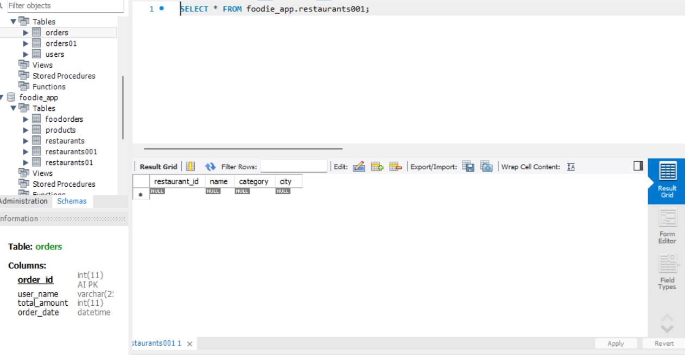
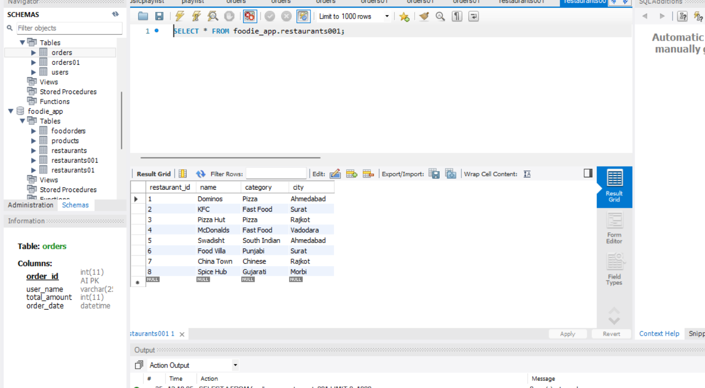
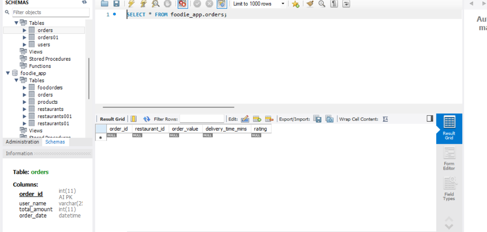
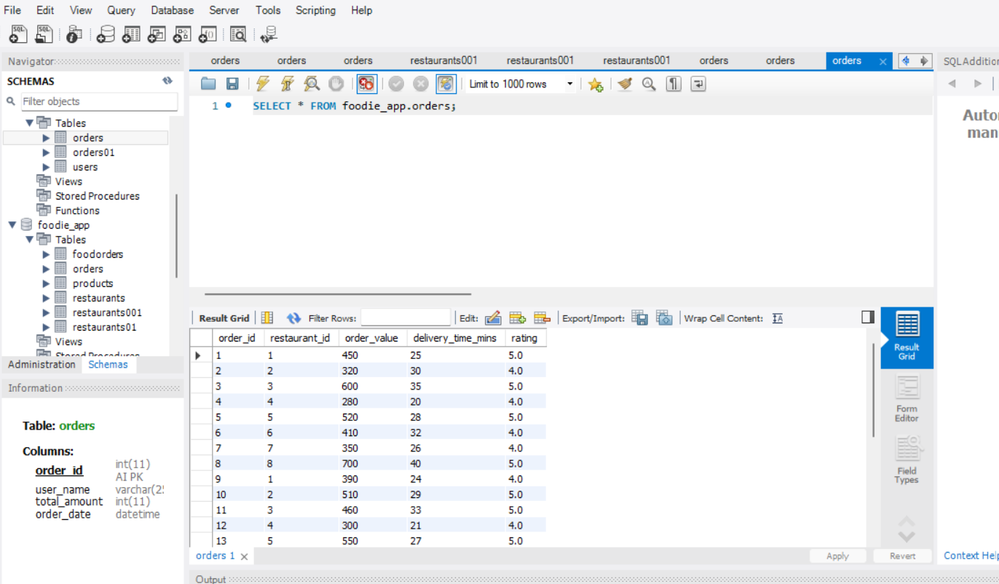
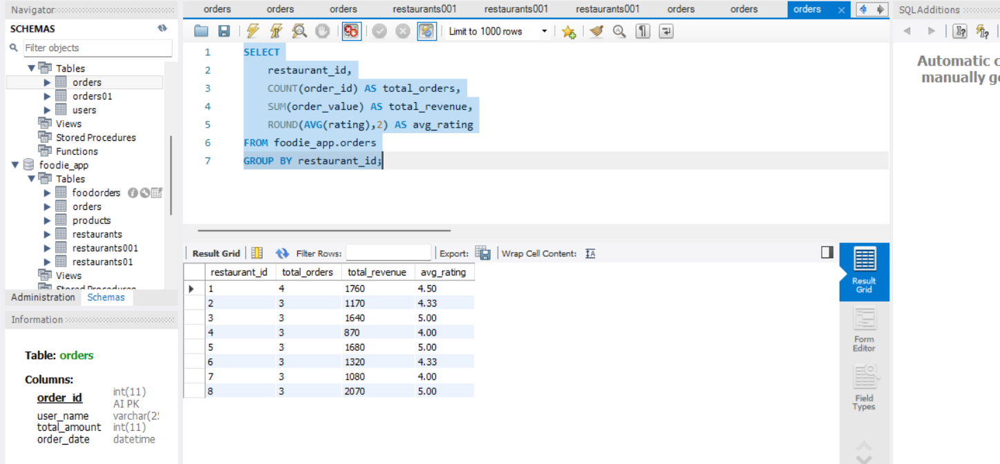

# Section B - Task 4

## Question

Build a Python program that creates, populates, and queries a SQLite food delivery database to generate a ranked restaurant performance report.

Using Python's sqlite3 module, create a database **food_delivery.db** with two tables:

- restaurants (restaurant_id INTEGER PRIMARY KEY, name TEXT, category TEXT, city TEXT)
- orders (order_id INTEGER PRIMARY KEY, restaurant_id INTEGER, order_value REAL, delivery_time_mins REAL, rating REAL)

Insert at least **8 restaurants** and **25 orders**.

Write a SQL query using **GROUP BY** with **COUNT()**, **SUM()**, and **ROUND(AVG(),2)** to compute:

- total_orders
- total_revenue
- avg_rating per restaurant.


*ANSWER...*


## Step 1 - Create the `restaurants` Table

**The `CREATE TABLE` statement is used to create a new table in the database.**

```

CREATE TABLE foodie_app.restaurants001 (
    restaurant_id INT PRIMARY KEY,
    name VARCHAR(100),
    category VARCHAR(100),
    city VARCHAR(100)
);


```
**NOTE** because i have already resturents table so i made resturents01 ....

GUI



## Step 2 - Insert Restaurant Records

The `INSERT INTO` statement is used to insert one or more records into a table.

**syntax**

```

INSERT INTO foodie_app.restaurants001
VALUES
(1, 'Dominos', 'Pizza', 'Ahmedabad'),
(2, 'KFC', 'Fast Food', 'Surat'),
(3, 'Pizza Hut', 'Pizza', 'Rajkot'),
(4, 'McDonalds', 'Fast Food', 'Vadodara'),
(5, 'Swadisht', 'South Indian', 'Ahmedabad'),
(6, 'Food Villa', 'Punjabi', 'Surat'),
(7, 'China Town', 'Chinese', 'Rajkot'),
(8, 'Spice Hub', 'Gujarati', 'Morbi');

```

GUI




-the restaurant records were successfully inserted into the `restaurants` table.


## Step 3 - Create the `orders` Table

The `CREATE TABLE` statement is used to create a new table in the database.

**synttax**

*create table*

```

CREATE TABLE foodie_app.orders
(
    order_id INT auto_increment PRIMARY KEY,
    restaurant_id INT,
    order_value DECIMAL,
    delivery_time_mins DECIMAL,
    rating DECIMAL
    )


```

GUI




# Step 4 - Insert Order Records

-The `INSERT INTO` statement is used to insert one or more records into a table.
-The `INSERT INTO` statement is used to insert one or more records into a table.


**syntax**


```

INSERT INTO foodie_app.orders
VALUES
(null,1,450.00,25,4.5),
(null,2,320.00,30,4.2),
(null,3,600.00,35,4.8),
(null,4,280.00,20,4.0),
(null,5,520.00,28,4.7),
(null,6,410.00,32,4.3),
(null,7,350.00,26,4.1),
(null,8,700.00,40,4.9),
(null,1,390.00,24,4.4),
(null,2,510.00,29,4.6),
(null,3,460.00,33,4.5),
(null,4,300.00,21,4.0),
(null,5,550.00,27,4.8),
(null,6,480.00,31,4.4),
(null,7,370.00,25,4.2),
(null,8,650.00,38,4.9),
(null,1,420.00,26,4.3),
(null,2,340.00,30,4.1),
(null,3,580.00,34,4.7),
(null,4,290.00,22,4.0),
(null,5,610.00,29,4.8),
(null,6,430.00,32,4.5),
(null,7,360.00,27,4.2),
(null,8,720.00,41,5.0),
(null,1,500.00,28,4.6);

```

GUI




-Twenty-five sample order records were successfully inserted into the `orders` table.

-The data includes different restaurants, order values, delivery times, and ratings, which will be used to generate the restaurant performance report in the next step.


## Step 5 - Generate Restaurant Performance Report

-The `GROUP BY` clause is used to group records based on a specific column.

-The `COUNT()`, `SUM()`, and `ROUND(AVG(),2)` functions are used to calculate the total orders, total revenue, and average rating for each restaurant.


SQL QUERY

```

SELECT
    restaurant_id,
    COUNT(order_id) AS total_orders,
    SUM(order_value) AS total_revenue,
    ROUND(AVG(rating),2) AS avg_rating
FROM foodie_app.orders
GROUP BY restaurant_id;

```

GUI




-The query successfully generated the restaurant performance report.
-The `GROUP BY` clause grouped the records by `restaurant_id`, while the `COUNT()`, `SUM()`, and `ROUND(AVG(),2)` functions calculated the total orders, total revenue, and average rating for each restaurant.


## Final Result

The SQLite database was created successfully with the `restaurants` and `orders` tables.

Sample data was inserted into both tables.

The restaurant performance report was generated using `GROUP BY`, `COUNT()`, `SUM()`, and `ROUND(AVG(),2)` to display the total orders, total revenue, and average rating for each restaurant.


## Note

*Only the SQL part of this task has been completed because the Python topics (`sqlite3`, `pandas`, and `to_csv`) have not yet been covered in class. The remaining Python implementation will be added after completing the Python module.*


