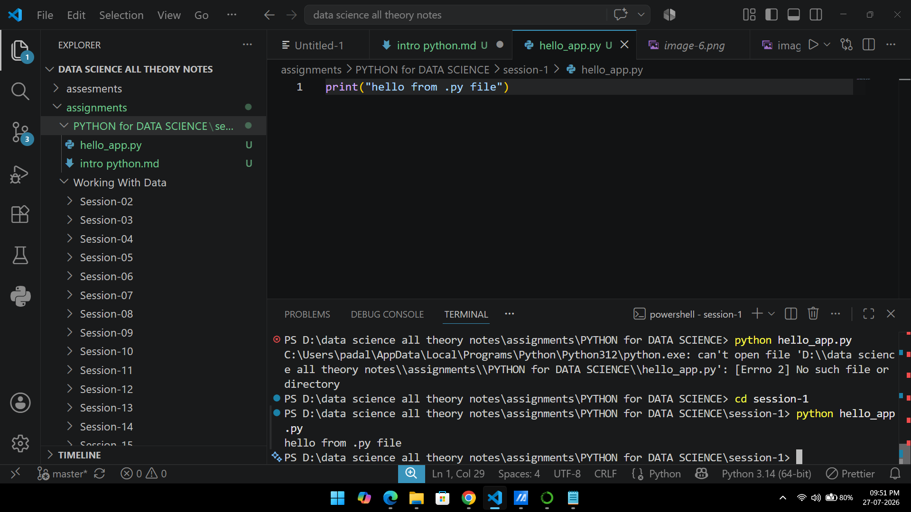

# 1.nstall Anaconda on your system and launch Jupyter Notebook from the Anaconda Navigator.


ANSWER...


STEP-1 install anaconda 

search in browser

https://www.anaconda.com/download


STEP-2 (jupyter notebook install)
```
pip install jupyter notebook

```

GUI


STEP-3 (print heelo meetu)

name="meetu"
print(name)


GUI


# 2 Create a new Jupyter Notebook file named insta_intro.ipynb and write a cell that prints your name and your favorite app (like Instagram or Zomato) using the print() function.

ANSWER...

step-1 create new file 


step-2 print name and favorite app

```

name="meetu"
app="instagram"

print(name)
print(app)

```


# 3.In Jupyter Notebook, add a new cell and write Python code to print the message: 'Welcome to Data Science with Python!'.

ANSWER...

```
message="welcome to data science with python"
print(message)

```


# 4.create a Python script file called hello_app.py (not a notebook) that prints 'Hello from .py file!' when run from the terminal.Hint Use a text editor like VS Code or Notepad to create the file, then run it using the command: python hello_app.py


ANSWER...

```

python hello_app.py 

```




