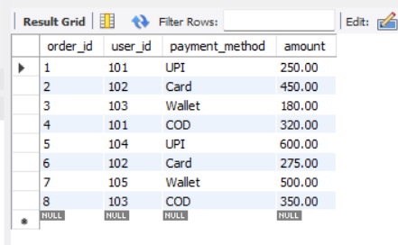
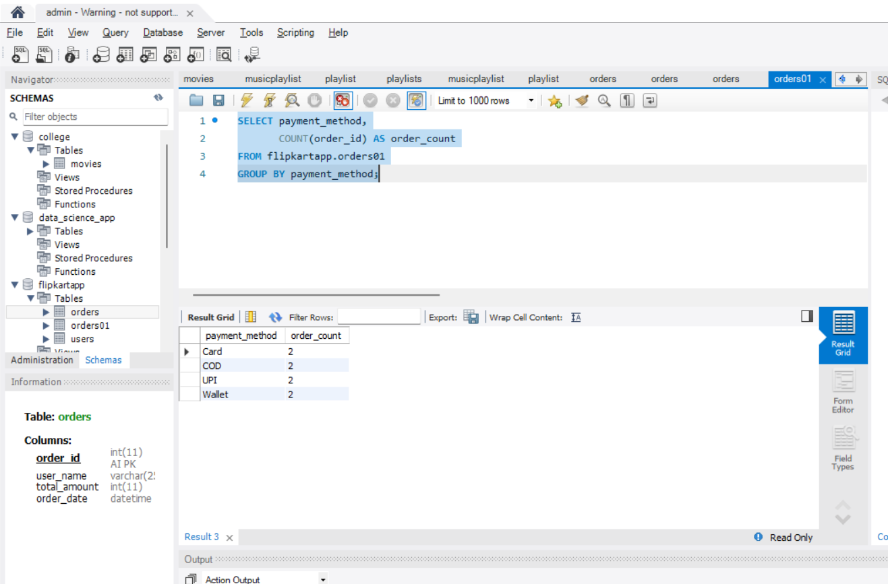
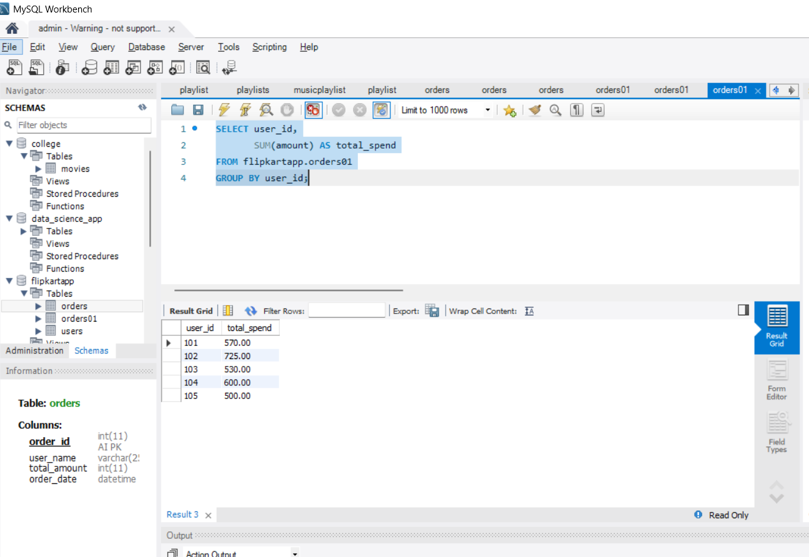
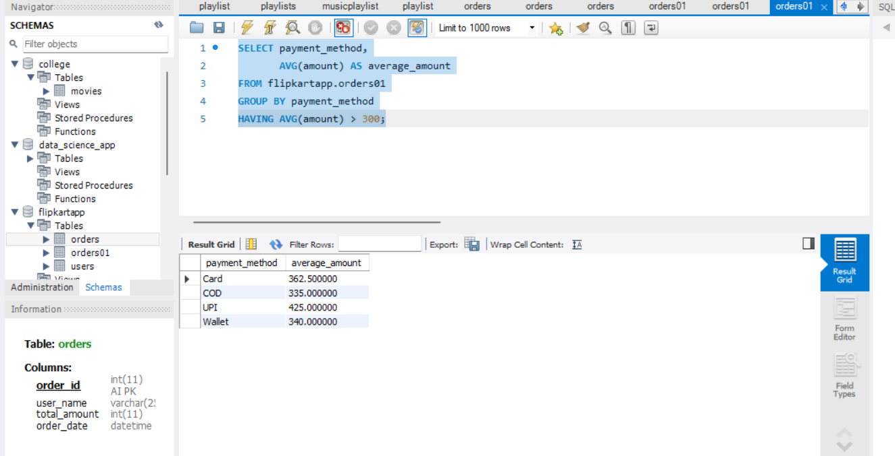
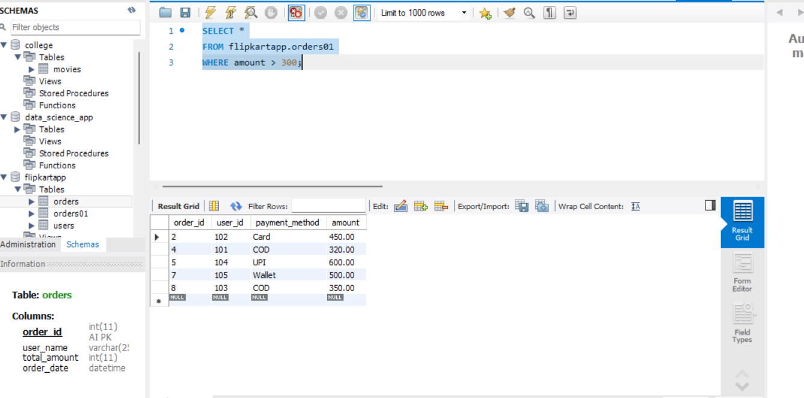
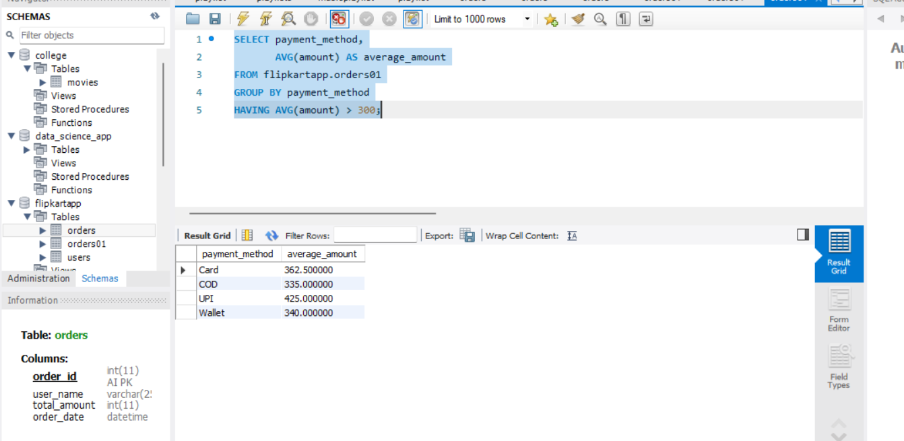

# 1.Create a table called Orders with columns: order_id, user_id, payment_method, and amount. Insert at least 8 sample records representing different users and payment methods (like UPI, Card, Wallet, COD).


ANSWER...

-The `CREATE TABLE` statement is used to create a new table in the database.

**syntax**

```

CREATE TABLE flipkartapp.Orders01 (
    order_id INT AUTO_INCREMENT PRIMARY KEY,
    user_id INT,
    payment_method VARCHAR(50),
    amount DECIMAL(10,2)
);

```

-The `INSERT INTO` statement is used to insert multiple records into the table.

**syntax**

```

INSERT INTO flipkartapp.orders01 VALUES
(1, 101, 'UPI', 250.00),
(2, 102, 'Card', 450.00),
(3, 103, 'Wallet', 180.00),
(4, 101, 'COD', 320.00),
(5, 104, 'UPI', 600.00),
(6, 102, 'Card', 275.00),
(7, 105, 'Wallet', 500.00),
(8, 103, 'COD', 350.00);

```

GUI



-The `Orders` table was created successfully.


# 2.Write an SQL query to count how many orders were placed using each payment_method in the Orders table, similar to how Zomato shows payment breakdown in analytics.

ANSWER...


-The `COUNT()` function is used to count the number of records.

**syntax**

```

SELECT payment_method,
       COUNT(order_id) AS order_count
FROM flipkartapp.orders01

```


-The `GROUP BY` clause is used to group records based on the `payment_method` column.

**syntax**

```

SELECT payment_method,
       COUNT(order_id) AS order_count
FROM flipkartapp.orders01
GROUP BY payment_method;

```

GUI



-The query successfully counted the number of orders for each payment method.
-The `COUNT()` function counted the orders, and the `GROUP BY` clause grouped the records by `payment_method`.

# 3.Write an SQL query to find the total amount spent by each user_id in the Orders table. Display user_id and their total spend.

ANSWER...


-The `SUM()` function is used to calculate the total value of a numeric column'

**syntax**

```

-SELECT user_id,
       SUM(amount) AS total_spend
FROM flipkartapp.orders01

```

-The `GROUP BY` clause is used to group records based on the `user_id` column.

**syntax**

```

SELECT user_id,
       SUM(amount) AS total_spend
FROM flipkartapp.orders01
GROUP BY user_id;

```

GUI



-The query successfully calculated the total amount spent by each user.
-The `SUM()` function calculated the total spending, and the `GROUP BY` clause grouped the records by `user_id`.

# 4.Write an SQL query to show only those payment methods where the average order amount is greater than 300, using GROUP BY and HAVING.Hint: Use AVG(amount) in your HAVING clause.

ANSWER...


-The `AVG()` function is used to calculate the average value of a numeric column.

**syntax**

```

SELECT payment_method,
       AVG(amount) AS average_amount
FROM flipkartapp.orders01
HAVING AVG(amount) > 300;

```

-The `HAVING` clause is used to filter grouped records based on aggregate functions.

**syntax**

```

SELECT payment_method,
       AVG(amount) AS average_amount
FROM flipkartapp.orders01
GROUP BY payment_method
HAVING AVG(amount) > 300;

```

GUI



-The query successfully displayed the payment methods whose average order amount was greater than **300**.
-The `AVG()` function calculated the average amount, and the `HAVING` clause filtered the grouped results.


# 5.Explain the difference between WHERE and HAVING by giving one example query for each, using the Orders table. Your examples should show a scenario where WHERE and HAVING filter different things.

ANSWER...


-The `WHERE` clause is used to filter individual rows before grouping.

**syntax**

```

SELECT *
FROM flipkartapp.orders01
WHERE amount > 300;

```

GUI



-The query displayed only those orders where the amount is greater than **300**


-*The `HAVING` clause is used to filter grouped records after the `GROUP BY` clause.

**syntax**

```

SELECT payment_method,
       AVG(amount) AS average_amount
FROM flipkartapp.orders01
GROUP BY payment_method
HAVING AVG(amount) > 300;

```

GUI



-the query displayed only those payment methods whose average order amount is greater than **300**.


