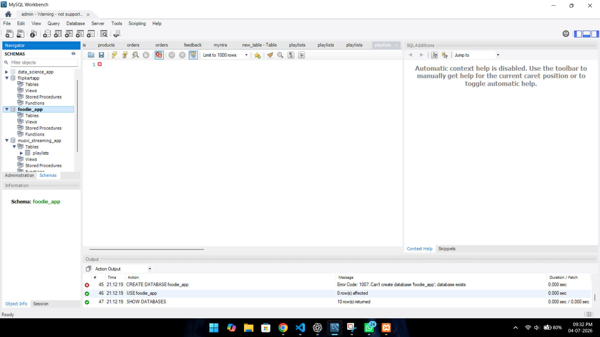
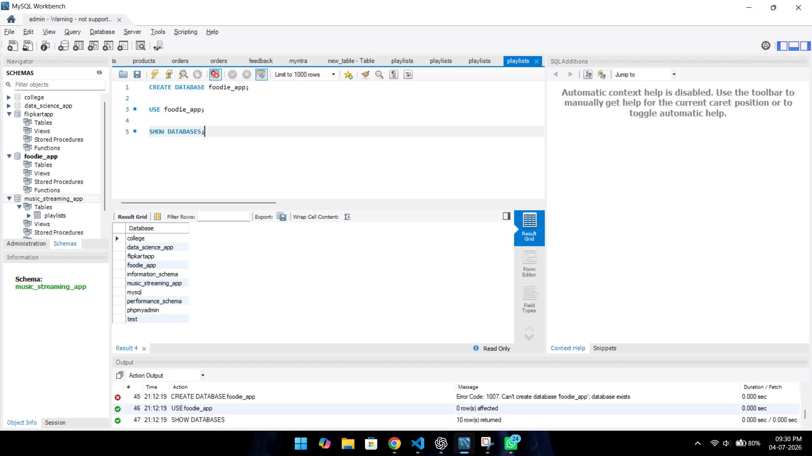
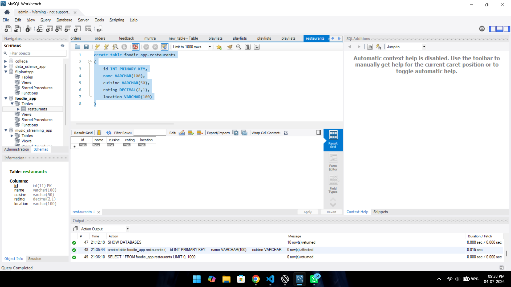
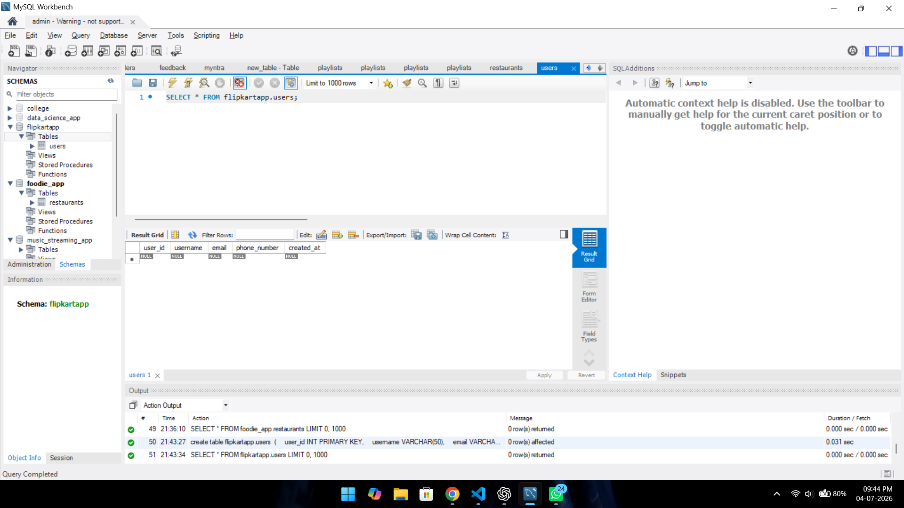
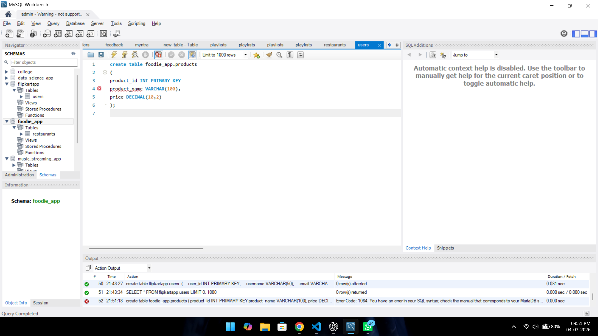

# 1.Install MySQL Community Server or SQLite on your system and verify the installation by connecting to the database using the command line or a GUI tool like MySQL Workbench or DB Browser for SQLite.

ANSWER...

-MySQL Community Server and MySQL Workbench were successfully installed on my system.
-The installation was verified by connecting to the MySQL Server using MySQL Workbench.
-The connection was successful, and I was able to create and access databases without any errors.

GUI

# 2. Create a new database named 'foodie_app' to simulate a Zomato-style backend.

ANSWER...

A new database named foodie_app was created successfully using the CREATE DATABASE statement and selected using the USE statement.

**syntext**

CREATE DATABASE foodie_app;

USE foodie_app;

SHOW DATABASES;:

GUI

# 3. Write a CREATE TABLE statement to define a 'restaurants' table in the 'foodie_app' database with the following columns:

  - id (INTEGER, PRIMARY KEY)
  - name (VARCHAR(100))
  - cuisine (VARCHAR(50))
  - rating (DECIMAL, e.g., 4.5)
  - location (VARCHAR(100))

ANSWER...

**syntext**

create table foodie_app.restaurants
(
    id INT PRIMARY KEY,
    name VARCHAR(100),
    cuisine VARCHAR(50),
    rating DECIMAL(2,1),
    location VARCHAR(100)
)

GUI

# 4. Design and create a 'users' table for a Flipkart-style app with columns:

  - user_id (PRIMARY KEY)
  - username
  - email
  - phone_number
  - created_at (DATE/TIME)

  Choose appropriate data types for each column.
  Think about which columns should be UNIQUE and which data types best fit email and phone numbers.

  ANSWER...

  we use uniqe key for phone number and email .

  **syntext**

  create table flipkartapp.users 
(
    user_id INT PRIMARY KEY,
    username VARCHAR(50),
    email VARCHAR(100) UNIQUE,
    phone_number VARCHAR(15) UNIQUE,
    created_at DATETIME
)

GUI

# 5. Intentionally make a mistake in your CREATE TABLE statement (such as missing a comma or using an unsupported data type), run it, and then fix the error based on the message you receive.

Take a screenshot of:
1. The error message
2. The corrected SQL statement

ANSWER...

 he query gives an error because there is a missing comma (`,`) after the `product_id INT PRIMARY KEY` column.

GUI OF ERORR.

create table foodie_app.products
(    product_id INT PRIMARY KEY
    product_name VARCHAR(100),
    price DECIMAL(10,2)
)

**solved syntext**

create table foodie_app.products
(    product_id INT PRIMARY KEY,
    product_name VARCHAR(100),
    price DECIMAL(10,2)
);