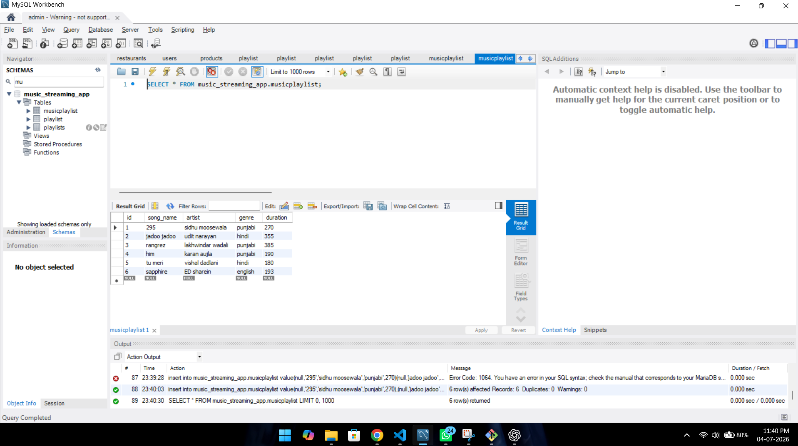
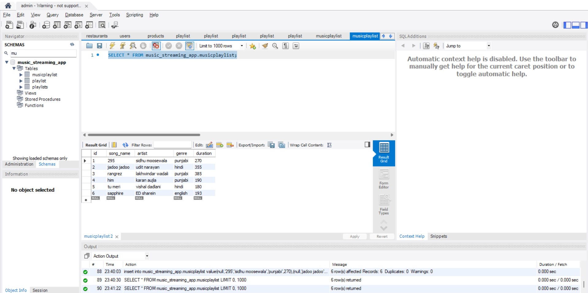
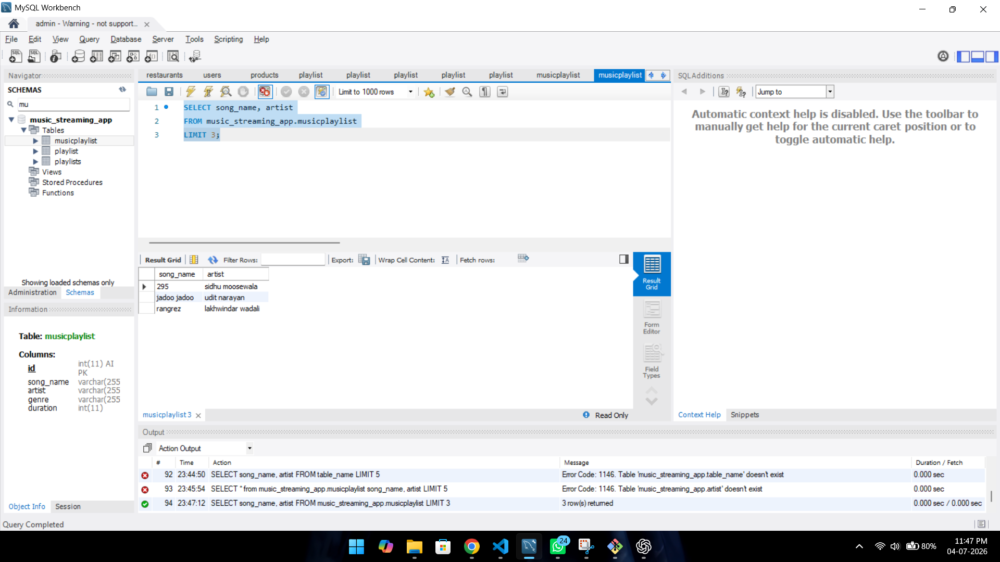
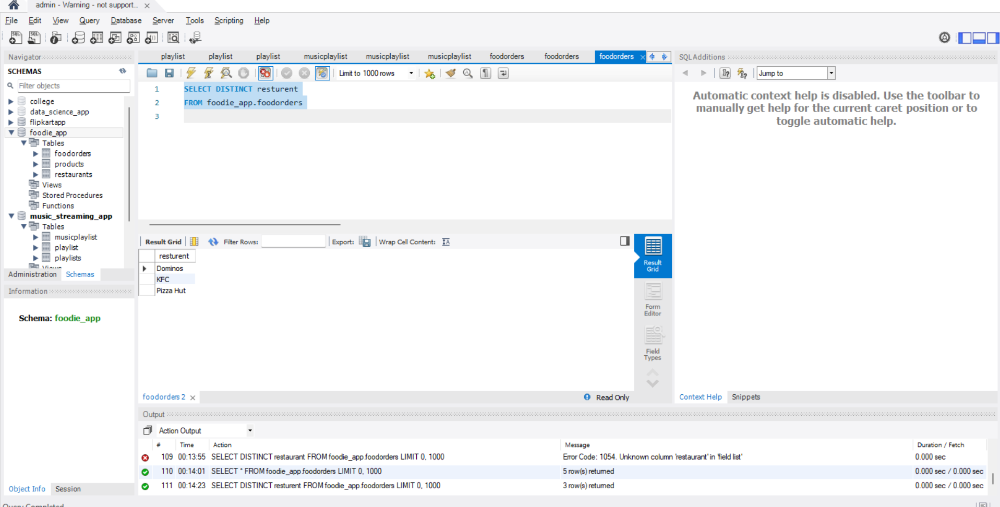
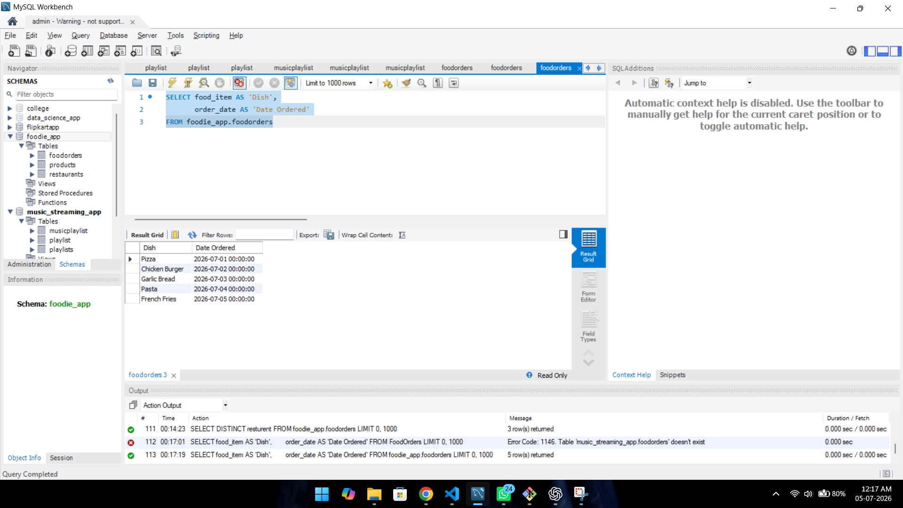

# 1. Create a table named MusicPlaylist with columns:

-id
-song_name
-artist
-genre
-duration

Insert at least 5 records representing songs from your favorite Spotify playlist, then write a SELECT statement to retrieve all columns for all songs.


ANSWER...


**create table musicplaylist**

CREATE TABLE MusicPlaylist (
    id INT AUTO_INCREMENT PRIMARY KEY,
    song_name VARCHAR(100),
    artist VARCHAR(100),
    genre VARCHAR(50),
    duration INT
);


**add data by insert**

insert into music_streaming_app.musicplaylist value(null,'295','sidhu moosewala','punjabi',270),(null,'jadoo jadoo','udit narayan','hindi',355),(null,'rangrez','lakhwindar wadali','punjabi',385),(null,'him','karan aujla','punjabi',190),(null,'tu meri','vishal dadlani','hindi',180),(null,'sapphire','ED sharein','english',193)

GUI



**all data select**

SELECT * FROM music_streaming_app.musicplaylist;

GUI




# 2. Write a SQL query to display only the song_name and artist columns from the MusicPlaylist table, showing just the first 3 records using the LIMIT keyword.

ANSWER...


**select 3 record from whole data**

SELECT song_name, artist
FROM music_streaming_app.musicplaylist
LIMIT 3;

GUI


-The query displayed only the `song_name` and `artist` columns from the `MusicPlaylist` table.
-The output was limited to the first **3 records** using `LIMIT 3`.


# 3.Suppose you have a table named FoodOrders with columns:

-id
-resturent
-food_item
-order_date

Write a SQL query to list all unique restaurant names where you have placed orders, using the DISTINCT keyword.

ANSWER...

create table foodorders **syntax is here**

```
create table foodie_app.foodorders
( id int auto_increment primary key,
resturent varchar(255),
food_item varchar(255),
order_date datetime
)

insert value

INSERT INTO foodie_app.foodorders
VALUES
(1, 'Dominos', 'Pizza', '2026-07-01'),
(2, 'KFC', 'Chicken Burger', '2026-07-02'),
(3, 'Dominos', 'Garlic Bread', '2026-07-03'),
(4, 'Pizza Hut', 'Pasta', '2026-07-04'),
(5, 'KFC', 'French Fries', '2026-07-05');


use of distinct key 
```
SELECT DISTINCT resturent
FROM foodie_app.foodorders;


GUI




-The query displayed all unique restaurant names from the FoodOrders table using the DISTINCT keyword.
-after using distinct query 

# 4. Write a SQL query on the FoodOrders table to select food_item as 'Dish' and order_date as 'Date Ordered', displaying only these two columns with the column aliases in the output.

ANSWER...

```

SELECT food_item AS 'Dish',
       order_date AS 'Date Ordered'
FROM foodie_app.foodorders

```

GUI




-The query displayed only the `food_item` and `order_date` columns from the `FoodOrders` table.
-The columns were renamed using aliases as **Dish** and **Date Ordered** in the output.

# 5.You tried running this query: SELECT DISTINCT food_item, restaurant FROM FoodOrders LIMIT 2, but it returns an error or doesn't work as expected. Identify and fix the mistake in the query.Hint: Check the correct placement and usage of the LIMIT keyword in SQL syntax.

ANSWER...


```sql
SELECT DISTINCT food_item, restaurant
FROM FoodOrders
LIMIT 2;


The given query is already correct. The `LIMIT` keyword is placed correctly after the `FROM` clause. Therefore, no changes are required.

The query displays the first **2 distinct** records containing the `food_item` and `restaurant` columns.

if the query is

```

SELECT DISTINCT food_item, restaurant
LIMIT 2
FROM FoodOrders;

```

so we definatly we can find errror and solw it and right qyery is

```

SELECT DISTINCT food_item, restaurant
FROM FoodOrders
LIMIT 2;

```

