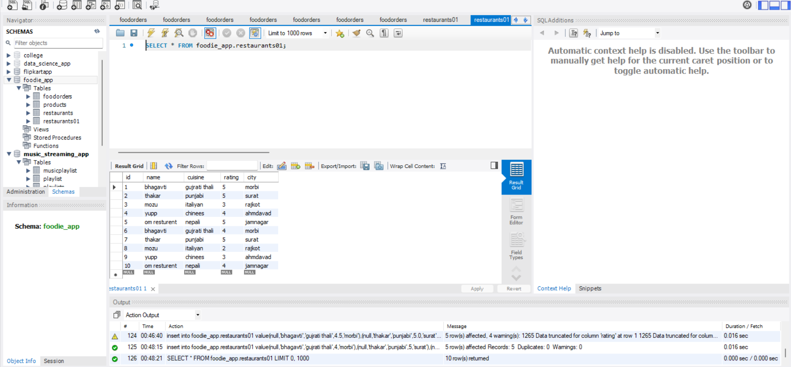
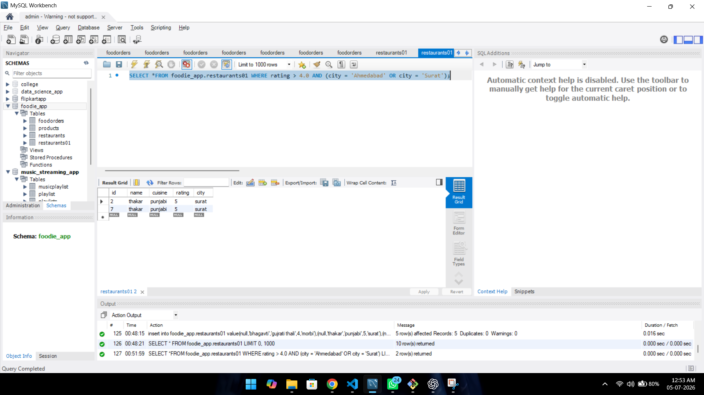
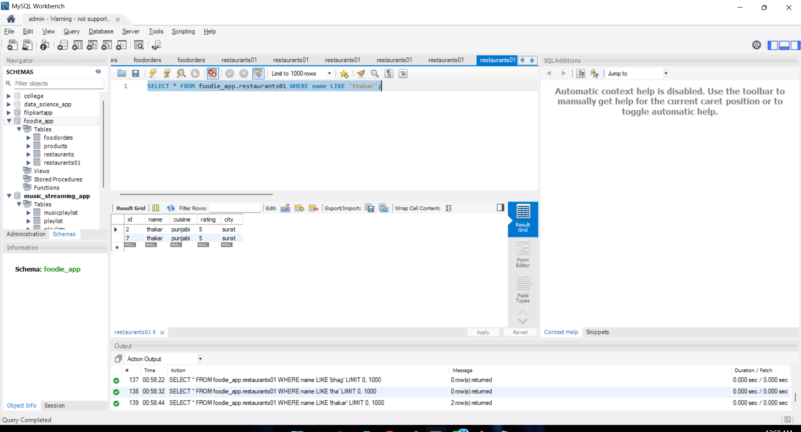
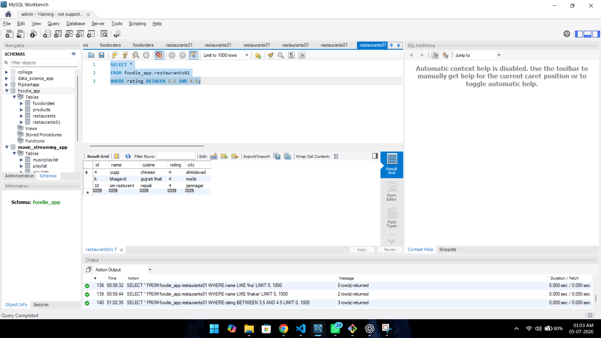
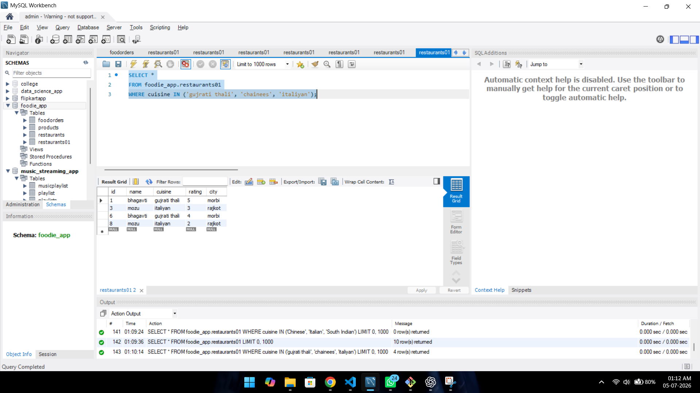

# 1.Create a table called Restaurants with the following columns:

-id
-name
-cuisine
-rating
-city

Insert at least 5 sample records representing real or fictional restaurants you might find on Zomato.


ANSWER...


create table resturent01

```

create table foodie_app.Restaurants01
( id int auto_increment primary key,
name varchar(255),
cuisine varchar(255),
rating decimal,
city varchar(255)
)

```

insert data in table 

```
insert into foodie_app.restaurants01 value(null,'bhagavti','gujrati thali',4,'morbi'),(null,'thakar','punjabi',5,'surat'),(null,'mozu','italiyan',2,'rajkot'),(null,'yupp','chinees',3,'ahmdavad'),(null,'om resturent','nepali',4,'jamnagar')

```

GUI




The `Restaurants01` table was created successfully.

Five sample records were inserted, and all restaurant details were displayed.


# 2.Write a SQL query to find all restaurants in the Restaurants table that:

-have a rating greater than 4.0
-and are located in either Ahmedabad or Surat.

ANSWER...

The query successfully displayed all restaurants with a rating greater than **4.0** that are located in **Ahmedabad** or **Surat**.


``` 

SELECT * FROM foodie_app.restaurants01 WHERE rating > 4.0 AND (city = 'Ahmedabad' OR city = 'Surat');

```
GUI




The query successfully displayed all restaurants with a rating greater than **4.0** that are located in **Ahmedabad** or **Surat**.

# 3.Using the LIKE operator, write a SQL query to select all restaurants whose names start with 'Swa' (for example, Swagat, Swadisht) from the Restaurants table.

ANSWER...


**query like example**

```
SELECT * FROM foodie_app.restaurants01 WHERE name LIKE 'thakar';

```




The query successfully displayed all restaurants whose names start with **"thakar"** using the `LIKE` operator.


# 4.Write a SQL query using the BETWEEN keyword to find all restaurants in the Restaurants table with a rating between 3.5 and 4.5 (inclusive

ANSWER...


between uses for renge of data.
between shoe us a renge of data betweeen 3.5 and 4.5

```

SELECT *
FROM foodie_app.restaurants01
WHERE rating BETWEEN 3.5 AND 4.5;

```

GUI




The query successfully displayed all restaurants with ratings between **3.5** and **4.5** (inclusive) using the `BETWEEN` keyword.


# 5.Write a query to find all restaurants whose cuisine is either:

Chinese
Italian
South Indian

using the IN operator

ANSWER...

The `IN` operator was used to match multiple cuisine values in a single condition.

like that

It returned restaurants whose cuisine is **Chinese**, **Italian**, or **South Indian**.

**syntax**

```

SELECT *
FROM foodie_app.restaurants01
WHERE cuisine IN ('gujrati thali', 'chainees', 'italiyan');

```

GUI




The query successfully displayed all restaurants whose cuisine is **gujrati thali**, **chainees**, or **italian** using the `IN` operator.