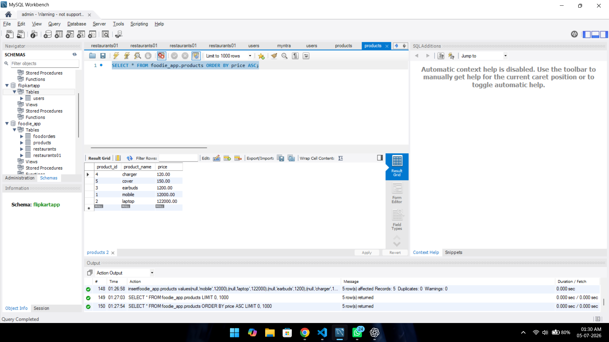
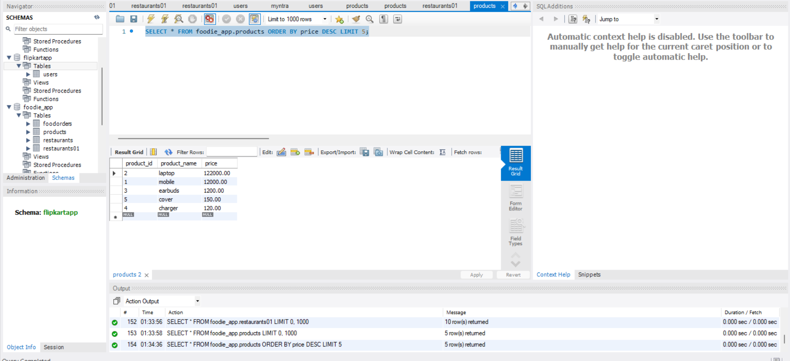
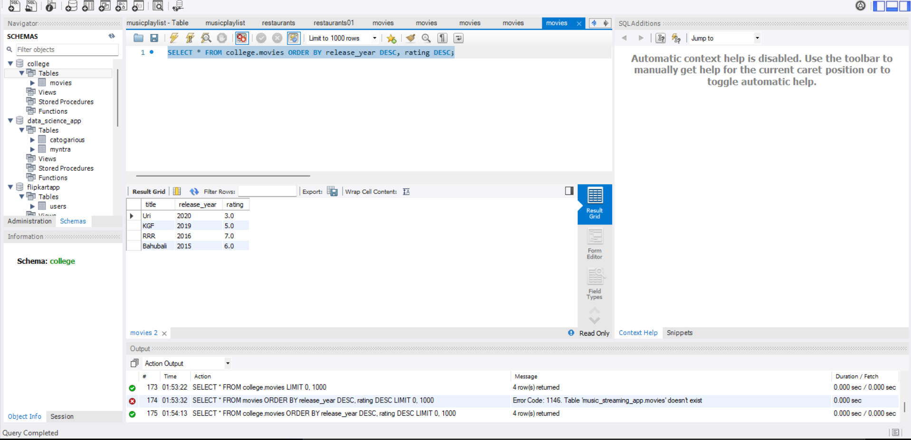
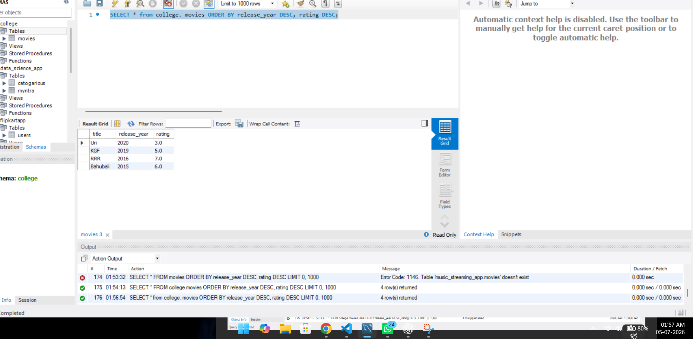
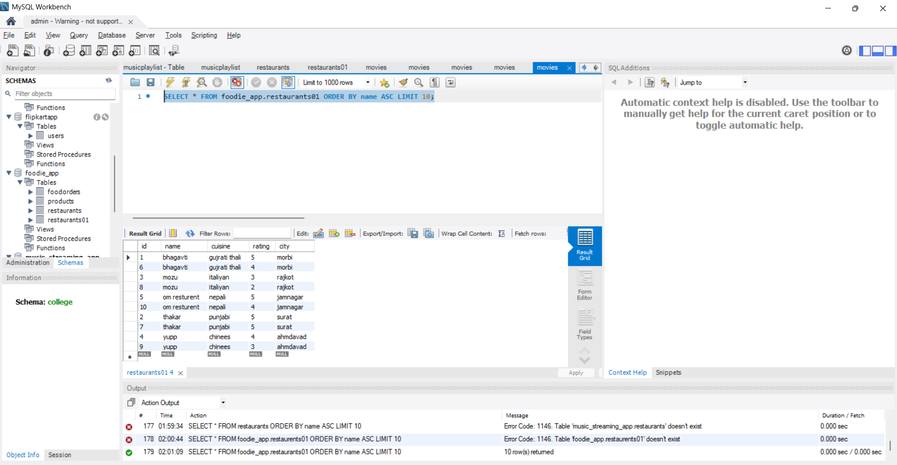
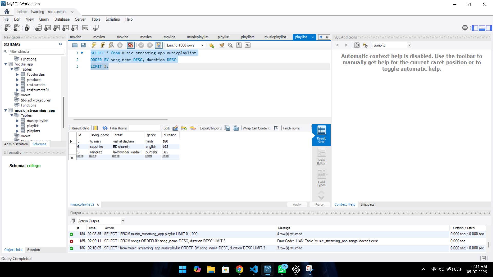

# 1.Write a SQL query to display all products from a products table and sort them by price in ascending order, similar to how Flipkart lists items from lowest to highest price.

ANSWER...

-The `ORDER BY` clause is used to sort the records in a specific order.**

-The `ASC` keyword sorts the data from the lowest value to the highest value.**

**syntax is here**

```
SELECT * FROM foodie_app.products ORDER BY price ASC;

```
GUI




-The query successfully retrieved all products from the `products` table.
-The products were sorted in **ascending order** based on their **price** using the `ORDER BY` clause.


# 2.Modify your previous query to show the top 5 most expensive products using ORDER BY, DESC, and LIMIT.

ANSWER...


-The `DESC` keyword is used to sort records in descending order.
-It displays the highest values first.


**syntax is here**

SELECT * FROM foodie_app.products ORDER BY price DESC LIMIT 5;

GUI



here is top 5 most expensive product shown through DESC query.


# 3.Given a movies table with columns:

title
release_year
rating

Write an SQL query to list all movies sorted:

first by release_year in descending order (latest first)
then by rating in descending order (highest rated first).

ANSWER...


-The `ORDER BY` clause can sort records using multiple columns.


first we creat a table movies 

```
create table college.movies
( title VARCHAR(100),
    release_year INT,
    rating DECIMAL(2,1)
);


```

and insert values 

```

INSERT INTO college.movies (title, release_year, rating)
VALUES
('KGF', 2019, 5),
('Uri', 2020, 3),
('Bahubali', 2015, 6),
('RRR', 2016, 7);

```


and now we use descending order

```

SELECT * FROM college.movies ORDER BY release_year DESC, rating DESC;

```

GUI




-The query successfully displayed all movies sorted by **release_year** in descending order.

now we do rating in descending order (highest rated first).


-If the values in the first column are the same, SQL sorts the records using the next column.

```

SELECT * from college. movies ORDER BY release_year DESC, rating DESC;

```

GUI



If two movies had the same release year, they were further sorted by **rating** in descending order.


# 4.Write an SQL query to display the first 10 restaurants from a restaurants table, sorted alphabetically by name, just like Zomato's A–Z listing.

ANSWER...

-The `ORDER BY` clause is used to sort records alphabetically by the restaurant name.
-The `LIMIT` keyword is used to display only the first 10 records.
```

SELECT * FROM foodie_app.restaurants01 ORDER BY name ASC LIMIT 10;

```

GUI




-The query successfully displayed the first **10 restaurants** from the `restaurants` table.
-The restaurants were sorted alphabetically by **name** using the `ORDER BY` clause.


# 5.Suppose you want to display the top 3 trending songs from a songs table based on play_count, but if two songs have the same play_count, the more recently added song should come first.

ANSWER...


-The `ORDER BY` clause can sort records using multiple columns.
-The `LIMIT` keyword is used to display only the top 3 records.

```

SELECT * from music_streaming_app.musicplaylist
ORDER BY song_name DESC, duration DESC
LIMIT 3;

```
GUI




-The query successfully displayed the **top 3 trending songs** based on the highest `play_count`.
-If two songs had the same `play_count`, the more recently added song was displayed first.