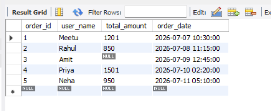
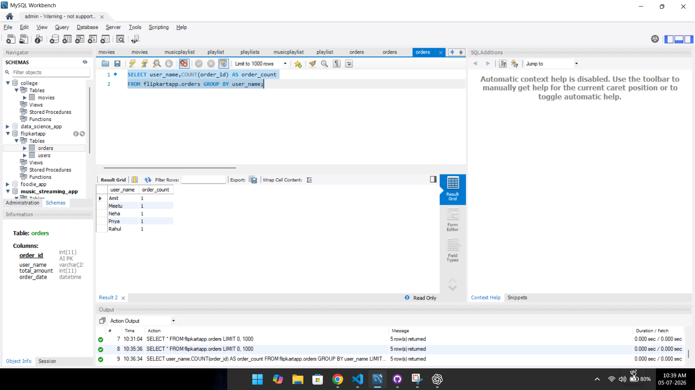
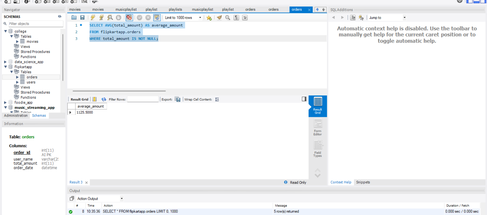
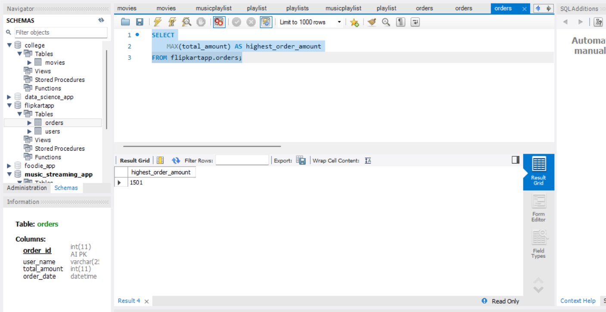
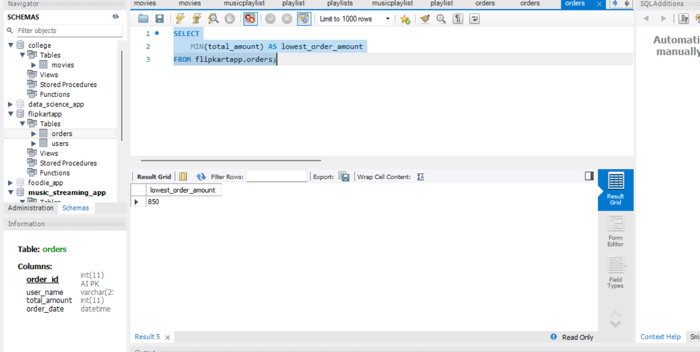
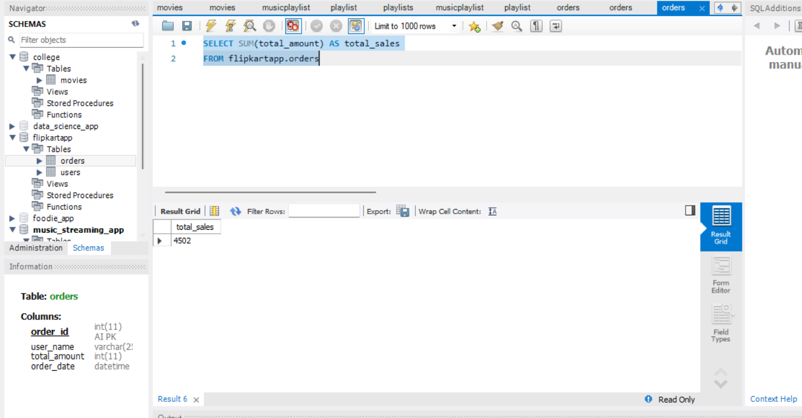
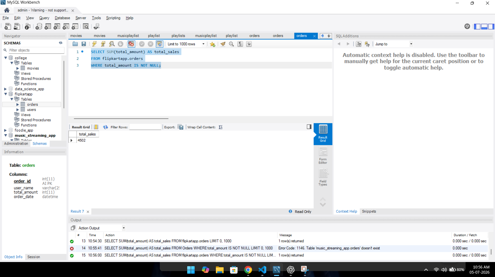

# 1. Create a table called Orders with columns:

-order_id
-user_name
-total_amount
-order_date

Insert 5 sample rows with different users and order amounts, including at least one NULL value for total_amount.


ANSWER...


-The `CREATE TABLE` statement is used to create a new table in the database.
-The `INSERT INTO` statement is used to add records into the table.


**syntax for create table**

```

CREATE TABLE Orders (
    order_id INT AUTO_INCREMENT PRIMARY KEY,
    user_name VARCHAR(255),
    total_amount init,
    order_date DATE
);

```

**syntax for insert data in table**

```

INSERT INTO flipkartapp.Orders 
VALUES
(1, 'Meetu', 1200.50, '2026-07-07'),
(2, 'Rahul', 850.00, '2026-07-08'),
(3, 'Amit', NULL, '2026-07-09'),
(4, 'Priya', 1500.75, '2026-07-10'),
(5, 'Neha', 950.25, '2026-07-11');

```

GUI of null value




-The `Orders` table was created successfully.
-Five sample records were inserted into the table, including one `NULL` value in the `total_amount` column. All records were displayed using the `SELECT` statement.


# 2.Write a SQL query to count how many orders were placed by each user in the Orders table, displaying user_name and the number of orders as order_count.

ANSWER...

-The `COUNT()` function is used to count the number of records.
The `GROUP BY` clause is used to group rows that have the same value in a column


**syntax is here**

```

SELECT user_name,COUNT(order_id) AS order_count
FROM flipkartapp.orders GROUP BY user_name;

```

GUI OF CIUNT AND GROUP BY QUERY.




-The query successfully counted the number of orders placed by each user.
-The `COUNT()` function counted the orders, and the `GROUP BY` clause grouped the records by `user_name`.


# 3.Write a SQL query to calculate the average total_amount of all orders in the Orders table, making sure to ignore any NULL values.


ANSWER...

-The `AVG()` function is used to calculate the average value of a numeric column.
-The `WHERE` clause is used to exclude `NULL` values before calculating the average.

**syntax is here**

```

SELECT AVG(total_amount) AS average_amount
FROM flipkartapp.orders
WHERE total_amount IS NOT NULL;

```

GUI of AVERAGE AMOUNT QUERY



-The query successfully calculated the average `total_amount` of all orders.
-The `AVG()` function ignored the `NULL` values using the `WHERE` clause.


# 4.Suppose you are building a Flipkart-style dashboard: Write a SQL query to find the highest and lowest order amounts (MAX and MIN) from the Orders table, and display both values in a single result row.


ANSWER...   


-The `MAX()` function is used to find the highest value in a numeric column

**syntax**

```

SELECT
    MAX(total_amount) AS highest_order_amount
FROM flipkartapp.orders;

```

GUI OF MAX TOTAL AMOUNT




-The `MIN()` function is used to find the lowest value in a numeric column.

**syntax**

```

SELECT
    MIN(total_amount) AS lowest_order_amount
FROM flipkartapp.orders;

```

GUI OF LOWEST TOTAL AMOUNT




-The query successfully displayed the highest and lowest order amounts from the `Orders` table.
-The `MAX()` function returned the highest order amount, and the `MIN()` function returned the lowest order amount in a single result.


# 5.Write a SQL query to calculate the total sales (SUM of total_amount) for all orders, but only include orders where total_amount is not NULL.Hint: Use a WHERE clause to filter out NULL values before applying the SUM function.

ANSWER...


-The `SUM()` function is used to calculate the total value of a numeric column

**syntax**

```

SELECT SUM(total_amount) AS total_sales
FROM flipkartapp.orders

```

GUI




-The `IS NOT NULL` condition is used to exclude records that contain `NULL` values

**syntax**

```

SELECT SUM(total_amount) AS total_sales
FROM flipkartapp.orders
WHERE total_amount IS NOT NULL;

```

GUI




-The query successfully calculated the total sales from the `Orders` table.
-The `SUM()` function added all non-`NULL` values, and the `IS NOT NULL` condition excluded records with missing values.

