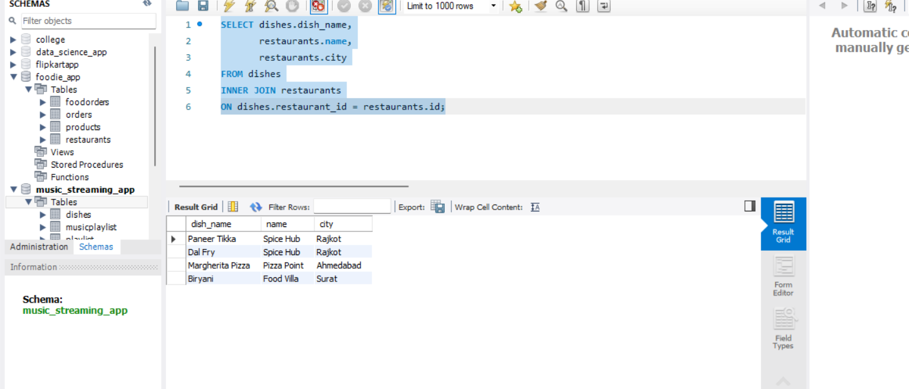
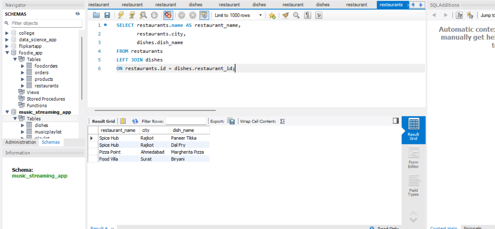
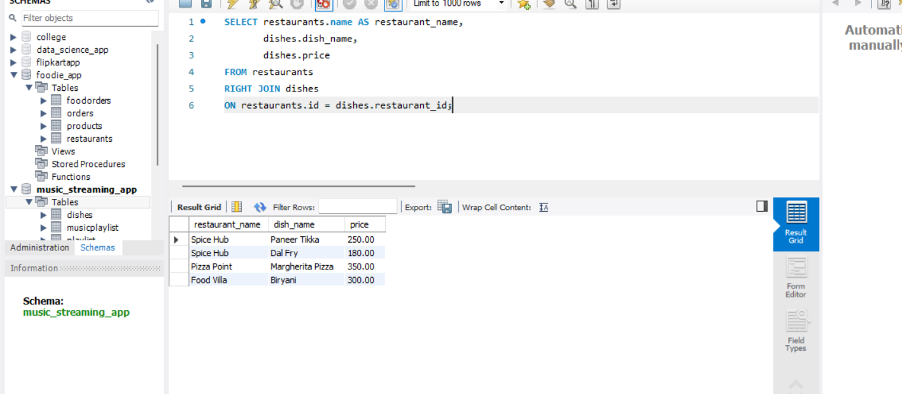
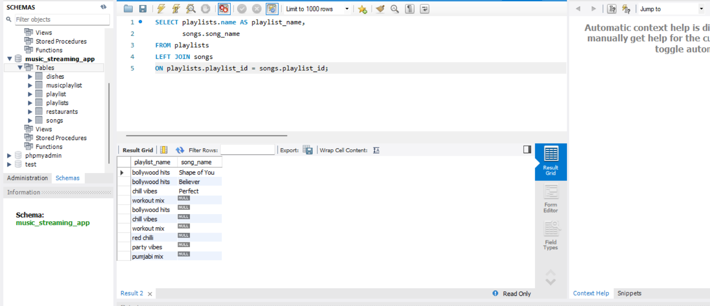

# 1.Create two tables in your database: 'restaurants' (id, name, city) and 'dishes' (id, restaurant_id, dish_name, price). Insert at least 3 restaurants and 2-3 dishes for each restaurant.

ANSWER...

1. create table restaurent and dishes.

**syntax**
```
CREATE TABLE restaurants (
    id INT PRIMARY KEY,
    name VARCHAR(100),
    city VARCHAR(50)
);

```

```

CREATE TABLE dishes (
    id INT PRIMARY KEY,
    restaurant_id INT,
    dish_name VARCHAR(100),
    price DECIMAL(10,2),
    FOREIGN KEY (restaurant_id) REFERENCES restaurants(id)
);

```


insert data in table

**syntax**

```

INSERT INTO restaurants (id, name, city)
VALUES
(1, 'Spice Hub', 'Rajkot'),
(2, 'Pizza Point', 'Ahmedabad'),
(3, 'Food Villa', 'Surat');

```

```

INSERT INTO dishes (id, restaurant_id, dish_name, price)
VALUES
(1, 1, 'Paneer Tikka', 250),
(2, 1, 'Dal Fry', 180),
(3, 2, 'Margherita Pizza', 350),
(4, 3, 'Biryani', 300);

```

# 2. Write an SQL query to count how many orders were placed using each payment_method in the Orders table, similar to how Zomato shows payment breakdown in analytics.

ANSWER..


The INNER JOIN is used to combine data from two tables based on a common column. In this query, the dishes table is joined with the restaurants table using the restaurant_id and id columns. This displays each dish along with its restaurant name and city. Only the records that have matching values in both tables are included in the result.

**syntax**

```

SELECT dishes.dish_name,
       restaurants.name,
       restaurants.city
FROM dishes
INNER JOIN restaurants
ON dishes.restaurant_id = restaurants.id;

```


GUI 




# 3.Write an SQL LEFT JOIN query to list all restaurants and their dishes, showing restaurants even if they currently have no dishes on the menu.

ANSWER...

The LEFT JOIN clause is used to display all records from the left table (restaurants) and the matching records from the right table (dishes). If a restaurant has no dishes, it will still appear in the result with NULL in the dish column.

**syntax**

```

SELECT restaurants.name AS restaurant_name,
       restaurants.city,
       dishes.dish_name
FROM restaurants
LEFT JOIN dishes
ON restaurants.id = dishes.restaurant_id;

```

GUI




# 4.Write an SQL RIGHT JOIN query to display all dishes and their restaurant names, including any dishes that might not be linked to a restaurant (simulate a data error where a dish has a restaurant_id that doesn't match any restaurant).

ANSWER...

The RIGHT JOIN clause is used to display all records from the right table (dishes) and the matching records from the left table (restaurants). If a dish is not linked to any restaurant due to an invalid restaurant_id, the restaurant name will appear as NULL, but the dish will still be displayed.


**syntax**

```

SELECT restaurants.name AS restaurant_name,
       dishes.dish_name,
       dishes.price
FROM restaurants
RIGHT JOIN dishes
ON restaurants.id = dishes.restaurant_id;

```

GUI



# 5.Given this scenario: You want to show a list of all playlists and the songs inside them, like Spotify. Explain which JOIN type (INNER, LEFT, or RIGHT) you would use to show all playlists, even if some are empty, and write the SQL query for it.

ANSWER...

To display all playlists, including those that do not contain any songs, LEFT JOIN is used. It returns all records from the playlists table and the matching records from the songs table. If a playlist has no songs, the song details will appear as NULL.

**syntax**

```

SELECT playlists.name AS playlist_name,
       songs.song_name
FROM playlists
LEFT JOIN songs
ON playlists.playlist_id = songs.playlist_id;

```

GUI




