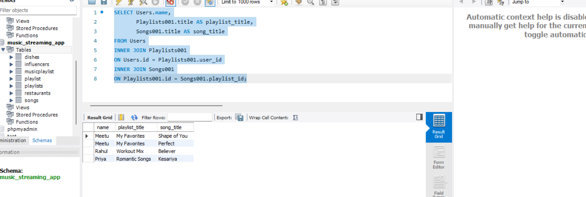

# 1.Create two tables: Influencers (id, name) and Collaborations (id, influencer1_id, influencer2_id, collab_date). Write a SQL FULL JOIN query to list all influencers and show their collaboration partner names if any, including influencers with no collaborations.


ANSWER...

create tables 

**syntax**

```

CREATE TABLE Influencers (
    id INT AUTO_INCREMENT PRIMARY KEY,
    name VARCHAR(100)
);

```

```

CREATE TABLE Collaborations (
    id INT  AUTO_INCREMENT PRIMARY KEY,
    influencer1_id INT,
    influencer2_id INT,
    collab_date DATE,
    FOREIGN KEY (influencer1_id) REFERENCES Influencers(id),
    FOREIGN KEY (influencer2_id) REFERENCES Influencers(id)
);

```


INSERT DATA ON THESE TABLES .


**syntax**

```

INSERT INTO Influencers (id, name)
VALUES
(1, 'Amit'),
(2, 'Priya'),
(3, 'Rahul'),
(4, 'Neha');

```

```

INSERT INTO Collaborations (id, influencer1_id, influencer2_id, collab_date)
VALUES
(1, 1, 2, '2026-07-01'),
(2, 2, 3, '2026-07-03');

```


-Now a FULL JOIN used to display all influencers along with their collaboration partner names.

**note**
- a FULL JOIN is noty supported in MYSQL WORKBENCH so i quitre this question here...


# 2.Using a SELF JOIN, write a query on a table called Playlists (id, user_id, playlist_name, parent_playlist_id) to display each playlist alongside its parent playlist name, similar to how Spotify shows nested playlists.

ANSWER...


- A SELF JOIN is used to join a table with itself. In this query, the Playlists table is joined with itself to display each playlist along with its parent playlist name

- SELF joIN used to Display each playlist with the name of its parent playlist by joining the Playlists table with itself.

**syntax**

```

SELECT Playlists.playlist_name,
       Parent.playlist_name AS parent_playlist_name
FROM Playlists
LEFT JOIN Playlists AS Parent
ON Playlists.parent_playlist_id = Parent.id;

```

# 3.Create three tables: Users (id, name), Playlists (id, user_id, title), and Songs (id, playlist_id, title). Write a SQL query using multiple JOINs to show each user's name, playlist title, and song title, similar to Spotify displaying user playlists with songs.

ANSWER...


first of all we creat  tables.

**syntax of all tables**

table-1

```

CREATE TABLE Users (
    id INT auto_increment PRIMARY KEY,
    name VARCHAR(255)
);

```
table-2

```

CREATE TABLE Playlists001 (
    id INT auto_increment PRIMARY KEY,
    user_id INT,
    title VARCHAR(255),
    FOREIGN KEY (user_id) REFERENCES Users(id)
);

```
table-3

```

CREATE TABLE Songs001 (
    id INT auto_increment PRIMARY KEY,
    playlist_id INT,
    title VARCHAR(255),
    FOREIGN KEY (playlist_id) REFERENCES Playlists001(id)
);

```

*we insert data in all tables.*

**syntax**

```

SELECT Users.name,
       Playlists001.title AS playlist_title,
       Songs001.title AS song_title
FROM Users
INNER JOIN Playlists001
ON Users.id = Playlists001.user_id
INNER JOIN Songs001
ON Playlists001.id = Songs001.playlist_id;

```

GUI




# 4.ou notice that your JOIN query between Zomato's Restaurants and Reviews tables is returning duplicate rows for some restaurants. Modify your query to eliminate duplicates and explain in one line why the duplicates were happening.

ANSWER...

- The DISTINCT keyword is used to remove duplicate rows from the result of a JOIN query.

**syntax**

```


SELECT DISTINCT Restaurants.name,
       Reviews.rating
FROM Restaurants
INNER JOIN Reviews
ON Restaurants.id = Reviews.restaurant_id;

```

- Duplicate rows were returned because one restaurant can have multiple reviews, causing the JOIN to return multiple matching records.


# 5.Write two different JOIN queries on a Products and Categories table (like Flipkart) to list all products with their category names, but use different join conditions in each. Briefly explain which join condition is more efficient and why.

ANSWER...

quary-1 

- using inner join

```

SELECT Products.product_name,
       Categories.category_name
FROM Products
INNER JOIN Categories
ON Products.category_id = Categories.id;

```


quary-2

- left join

```

SELECT Products.product_name,
       Categories.category_name
FROM Products
LEFT JOIN Categories
ON Products.category_id = Categories.id;

```


- INNER JOIN is more efficient because it returns only the matching records from both tables. LEFT JOIN returns all records from the Products table, including those without a matching category, which may process more rows.


- 
- Multiple JOINs are used to combine data from the Users, Playlists, and Songs tables. This query displays each user's name along with their playlist title and song title


