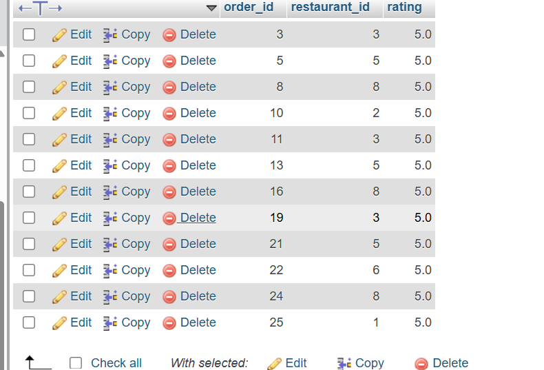
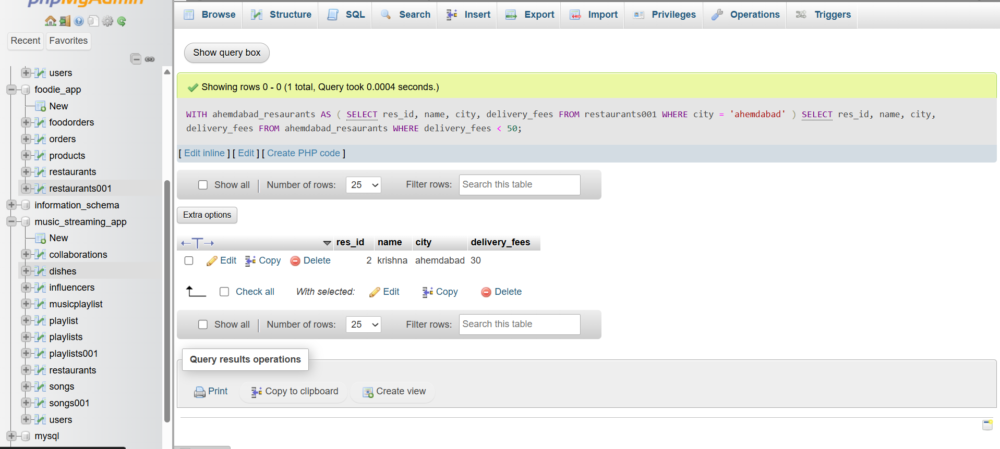
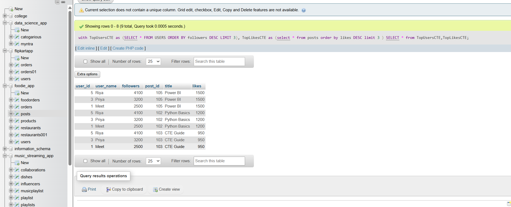
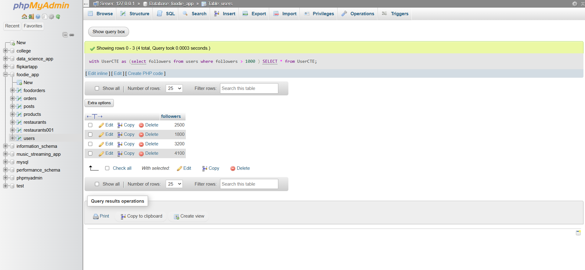

# 1. Create a CTE using the WITH clause to select all products with a rating above 4.5 from a 'Products' table, similar to how Flipkart or Myntra might highlight top-rated items.


ANSWER....

Here i show how to make CTE and how its works... 

**SYNTAX**

```

WITH avgratingCTE (avragevalue) as ( SELECT avg(rating) from orders )
SELECT order_id,restaurant_id,rating from orders where rating > (4.5);

```
GUI



# 2. Rewrite a query that finds all restaurants in 'Ahmedabad' with delivery charges under 50 from a 'Restaurants' table, first using a subquery and then using a CTE. Compare both queries for readability.    Hint: Focus on making the CTE version cleaner and easier to understand.


ANSWER...

delivery charge under 50 clarify with CET witho following step.....
first i select data of ahmdabad data from table.

**synax**

```
SELECT res_id, name, city, delivery_fees 
FROM restaurants001
WHERE city = 'ahemdabad' AND delivery_fees < 50;

```


now i use with clause query and then i combine both of queryies on table


**syntax**

```

WITH ahemdabad_resaurants AS (
    SELECT res_id, name, city, delivery_fees 
    FROM restaurants001
    WHERE city = 'ahemdabad'

```


now use both of queryies

```

WITH ahemdabad_resaurants AS (
    SELECT res_id, name, city, delivery_fees 
    FROM restaurants001
    WHERE city = 'ahemdabad'
)
SELECT res_id, name, city, delivery_fees 
FROM ahemdabad_resaurants
WHERE delivery_fees < 50;

```


GUI




# 3. Using two CTEs in a single query, find the top 3 most-followed users and the top 3 most-liked posts from Users and Posts tables. Output both lists in the same result set.

ANSWER...
table users query no. 1

**syntax**

```

WITH TopUsersCTE AS(SELECT * FROM Users ORDER BY followers DESC LIMIT 3 ) SELECT * FROM TopUsersCTE;

```

table posts query no.2

**syntax**

```

with TopPostsCTE as (select * from posts order by likes DESC limit 3) select * from TopPostsCTE;


```

now both of query in same table 

**syntax**

```

with TopUsersCTE as (SELECT * FROM USERS ORDER BY followers DESC LIMIT 3),
TopLikesCTE as (select * from posts order by likes DESC limit 3 )

SELECT * from TopUsersCTE,TopLikesCTE;

```

GUI 




# 4.Write a recursive CTE that generates a list of dates for the next 7 days starting from today, similar to how BookMyShow shows available dates for movie bookings.>Hint:Use a base case for today and recursion to add one day at a time.

ANSWER...

**syntax**

```

WITH RECURSIVE Next7Days AS
(
    SELECT CURDATE() AS BookingDate

    UNION ALL

    SELECT BookingDate + INTERVAL 1 DAY
    FROM Next7Days
    WHERE BookingDate < CURDATE() + INTERVAL 6 DAY
)

SELECT * FROM Next7Days;

```
# 5.Given a messy SQL query that finds all users with more than 1000 followers from a 'Users' table, refactor it to use a CTE for better clarity and maintainability.

ANSWEWR...

**syntax**

```

with UserCTE as (select followers from users where followers > 1000 ) SELECT * from UserCTE ;

```

GUI




