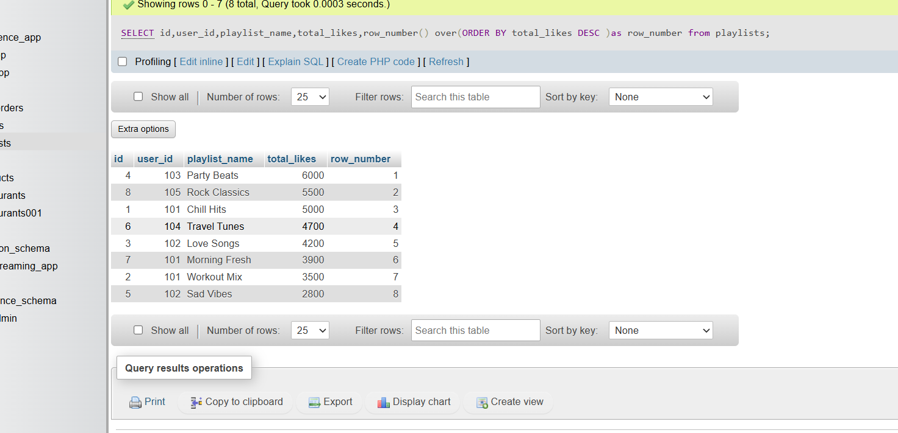
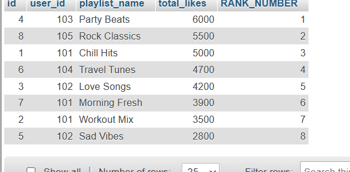
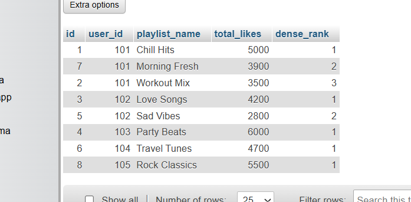
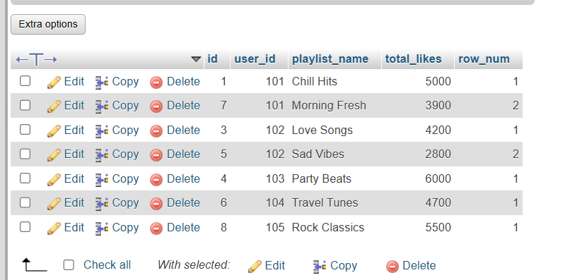

# 1.Create a table named Playlists with columns: id, user_id, playlist_name, and total_likes. Insert at least 8 sample rows with different users and playlists, making sure some playlists have the same user_id ?


answer...


creat table from this syntax..

```

CREATE TABLE Playlists (
    id INT AUTO_INCREMENT PRIMARY KEY,
    user_id INT,
    playlist_name VARCHAR(100),
    total_likes INT
);

```

insert data with following step..

```

INSERT INTO Playlists (id, user_id, playlist_name, total_likes)
VALUES
(null, 101, 'Chill Hits', 5000),
(null, 101, 'Workout Mix', 3500),
(null, 102, 'Love Songs', 4200),
(null, 103, 'Party Beats', 6000),
(null, 102, 'Sad Vibes', 2800),
(null, 104, 'Travel Tunes', 4700),
(null, 101, 'Morning Fresh', 3900),
(null, 105, 'Rock Classics', 5500);

```


# 2.Write a SQL query using ROW_NUMBER() and the OVER() clause to assign a unique row number to each playlist, ordered by total_likes in descending order.

ANSWER...

**syntax**

```

SELECT id,user_id,playlist_name,total_likes,row_number() over(ORDER BY total_likes DESC )as row_number from playlists;

```

GUI




# 3.Use the RANK() function to rank playlists based on total_likes in descending order. If two playlists have the same total_likes, they should receive the same rank.

ANSWER...

```

SELECT id,user_id,playlist_name,total_likes,RANK() over(ORDER BY total_likes DESC )as RANK_NUMBER from playlists

```

GUI




# 4.Use DENSE_RANK() with PARTITION BY user_id to rank each user's playlists based on total_likes in descending order.

ANSWER...

```

SELECT id,user_id,playlist_name,total_likes,DENSE_RANK() OVER (PARTITION BY user_id ORDER BY total_likes DESC) AS dense_rank FROM Playlists;

```

GUI




# 5.Retrieve the top 2 playlists for each user based on total_likes.

ANSWER...

```

WITH PlaylistRank AS (SELECT id,user_id,playlist_name,total_likes,ROW_NUMBER() OVER(PARTITION BY user_id ORDER BY total_likes DESC) AS row_num FROM Playlists)
SELECT * FROM PlaylistRank
WHERE row_num <= 2;

```

GUI

