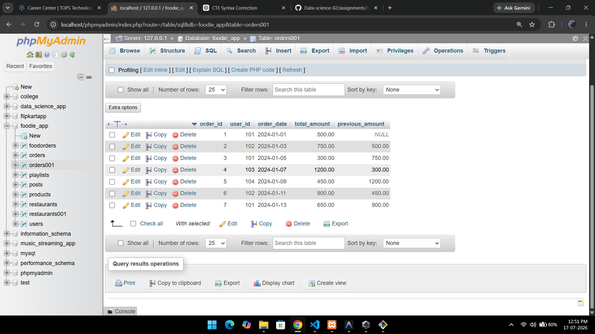
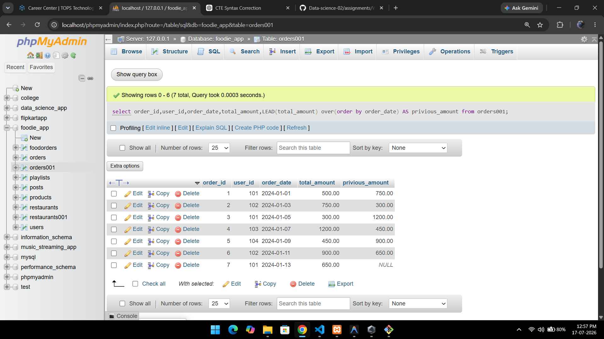
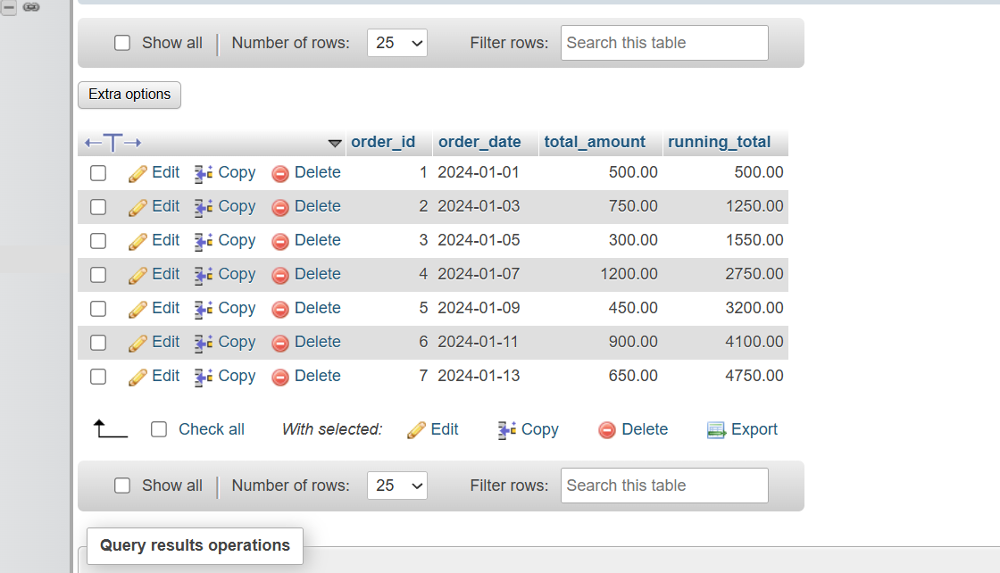
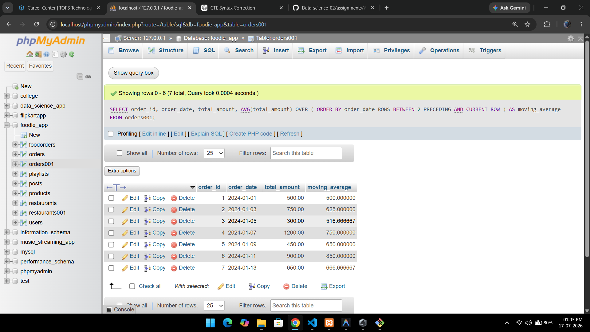

# 1.Create a table called Orders with columns order_id, user_id, order_date, and total_amount. Insert at least 7 sample rows representing different users and dates.

ANSWER...

```

CREATE TABLE Orders001 (
    order_id INT AUTO_INCREMENT PRIMARY KEY,
    user_id INT,
    order_date DATE,
    total_amount DECIMAL(10,2)
);

INSERT INTO Orders001 VALUES
(1, 101, '2024-01-01', 500.00),
(2, 102, '2024-01-03', 750.00),
(3, 101, '2024-01-05', 300.00),
(4, 103, '2024-01-07', 1200.00),
(5, 104, '2024-01-09', 450.00),
(6, 102, '2024-01-11', 900.00),
(7, 101, '2024-01-13', 650.00);


```


both query in 1 syntax 


# 2.Write a SQL query using the LAG() function to show each user's order_id, order_date, and the total_amount of their previous order (if any), ordered by user and date.Hint:Use PARTITION BY user_id and ORDER BY order_date in your window function.

ANSWER...

```

SELECT order_id,user_id,order_date,total_amount,LAG(total_amount) OVER (ORDER BY order_date) AS previous_amount
FROM orders001;

```

GUI



# 3.Using the same Orders table, write a SQL query with the LEAD() function to display each order_id, order_date, and the next order's total_amount for the same user.

ANSWER...


```

select order_id,user_id,order_date,total_amount,LEAD(total_amount) over(order by order_date) AS privious_amount from orders001;


```

GUI



# 4. Write a SQL query to calculate the running total of total_amount for each user, showing order_id, order_date, total_amount, and a column running_total that accumulates the sum as you move through each user's orders.

ANSWER...


```

SELECT
    order_id,
    order_date,
    total_amount,
    SUM(total_amount) OVER (
        ORDER BY order_date
    ) AS running_total
FROM orders001;

```

GUI



# 5.Write a SQL query to calculate a 3-order moving average of total_amount for each user, showing order_id, order_date, total_amount, and moving_avg columns.Constraint Use SUM() OVER() with ROWS BETWEEN 2 PRECEDING AND CURRENT ROW to compute the moving average.

ANSWER...

```

SELECT
    order_id,
    order_date,
    total_amount,
    AVG(total_amount) OVER (
        ORDER BY order_date
        ROWS BETWEEN 2 PRECEDING AND CURRENT ROW
    ) AS moving_average
FROM orders001;

```


GUI



