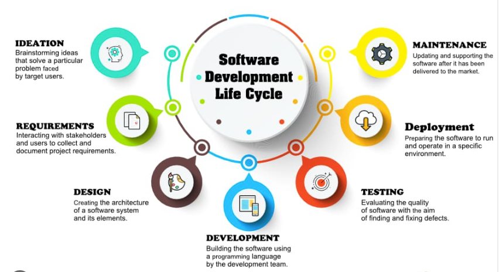

# Software Development Life Cycle (SDLC)

## What is SDLC?

**SDLC (Software Development Life Cycle)** is a structured process used to design, develop, test, deploy, and maintain software applications. It provides a systematic approach to software development, ensuring high quality, cost efficiency, and timely delivery.

### Objectives of SDLC

- Deliver high-quality software
- Meet customer requirements
- Reduce development costs
- Improve project management
- Minimize risks and errors
- Ensure maintainability and scalability

---

# Phases of SDLC

A typical SDLC consists of the following phases:

1. Planning
2. Requirement Analysis
3. System Design
4. Development (Coding)
5. Testing
6. Deployment
7. Maintenance

---

# 1. Planning Phase

## Purpose

The planning phase determines the project's scope, objectives, feasibility, budget, timeline, and resources.

## Activities

- Define project goals
- Identify stakeholders
- Conduct feasibility study
- Estimate costs and resources
- Create project schedule
- Risk assessment

## Deliverables

- Project Plan
- Feasibility Report
- Budget Estimation
- Risk Analysis Document

## Example

A company decides to develop an online shopping application and estimates the required budget, team size, and timeline.

---

# 2. Requirement Analysis Phase

## Purpose

Gather and analyze business and user requirements.

## Activities

- Interview stakeholders
- Conduct surveys
- Gather functional requirements
- Gather non-functional requirements
- Document requirements

## Types of Requirements

### Functional Requirements

Describe what the system should do.

Examples:

- User Registration
- Login System
- Product Search
- Payment Processing

### Non-Functional Requirements

Describe how the system should perform.

Examples:

- Security
- Performance
- Reliability
- Scalability

## Deliverables

- Software Requirement Specification (SRS)
- Requirement Documents
- Use Cases

## Example

The shopping application must allow customers to browse products, add items to cart, and make payments.

---

# 3. System Design Phase

## Purpose

Convert requirements into technical specifications.

## Activities

- Design system architecture
- Create database design
- Design UI/UX
- Define APIs
- Select technologies

## Types of Design

### High-Level Design (HLD)

Defines:

- Architecture
- Modules
- Technology Stack
- System Components

### Low-Level Design (LLD)

Defines:

- Classes
- Functions
- Database Tables
- Algorithms

## Deliverables

- Design Documents
- Architecture Diagrams
- Database Schema
- UI Mockups

## Example

Designing:

- Frontend using React
- Backend using Node.js
- Database using MySQL

---

# 4. Development Phase

## Purpose

Convert designs into actual software through coding.

## Activities

- Write source code
- Implement features
- Create APIs
- Database integration
- Code reviews

## Technologies

### Frontend

- HTML
- CSS
- JavaScript
- React
- Angular

### Backend

- Node.js
- Java
- Python
- PHP
- .NET

### Database

- MySQL
- PostgreSQL
- MongoDB

## Deliverables

- Source Code
- Application Modules
- Database Scripts

## Example

Developing the shopping cart, payment system, and user dashboard.

---

# 5. Testing Phase

## Purpose

Identify and fix defects before deployment.

## Activities

- Create test cases
- Execute tests
- Report bugs
- Verify fixes

## Types of Testing

### Unit Testing

Tests individual functions or components.

### Integration Testing

Tests interaction between modules.

### System Testing

Tests the complete application.

### Acceptance Testing

Tests whether requirements are met.

### Regression Testing

Ensures existing features still work after changes.

### Performance Testing

Measures speed and scalability.

### Security Testing

Identifies vulnerabilities.

## Deliverables

- Test Cases
- Test Reports
- Bug Reports

## Example

Testing login, payment processing, and order placement.

---

# 6. Deployment Phase

## Purpose

Release the software to users.

## Activities

- Configure servers
- Install application
- Migrate databases
- Monitor deployment

## Deployment Types

### Direct Deployment

Replace old system immediately.

### Phased Deployment

Release in stages.

### Blue-Green Deployment

Maintain two environments for smooth switching.

### Rolling Deployment

Gradually update servers.

## Deliverables

- Production Application
- Deployment Documentation

## Example

Launching the shopping website for customers.

---

# 7. Maintenance Phase

## Purpose

Support and improve software after deployment.

## Activities

- Fix bugs
- Add new features
- Improve performance
- Update security patches
- Monitor system health

## Types of Maintenance

### Corrective Maintenance

Fix defects and bugs.

### Adaptive Maintenance

Adapt to environmental changes.

### Perfective Maintenance

Improve performance and usability.

### Preventive Maintenance

Reduce future risks.

## Deliverables

- Software Updates
- Patch Releases
- Maintenance Reports

## Example

Adding new payment gateways and fixing reported issues.

---

# SDLC Workflow

Planning
↓
Requirement Analysis
↓
System Design
↓
Development
↓
Testing
↓
Deployment
↓
Maintenance

---

# Popular SDLC Models

## 1. Waterfall Model

- Sequential approach
- Each phase completed before next starts

### Advantages

- Simple
- Easy to manage

### Disadvantages

- Difficult to handle changing requirements

---

## 2. V-Model

- Testing planned alongside development
- Strong quality assurance

---

## 3. Iterative Model

- Develop software in repeated cycles
- Continuous improvements

---

## 4. Spiral Model

- Risk-driven development
- Suitable for large projects

---

## 5. Agile Model

- Incremental development
- Frequent customer feedback
- Flexible requirements

Popular Frameworks:

- Scrum
- Kanban
- Extreme Programming (XP)

---

## 6. DevOps Model

- Integrates development and operations
- Focuses on automation and continuous delivery

Tools:

- Git
- Jenkins
- Docker
- Kubernetes

---

# Benefits of SDLC

- Better project planning
- Improved software quality
- Reduced development cost
- Faster delivery
- Easier maintenance
- Better risk management
- Enhanced customer satisfaction

---

# Summary

SDLC is a systematic process for building software.

Core Phases:

1. Planning
2. Requirement Analysis
3. System Design
4. Development
5. Testing
6. Deployment
7. Maintenance

Popular Models:

- Waterfall
- V-Model
- Iterative
- Spiral
- Agile
- DevOps

# architectures of SDLC

Following SDLC helps organizations deliver reliable, scalable, and high-quality software efficiently.