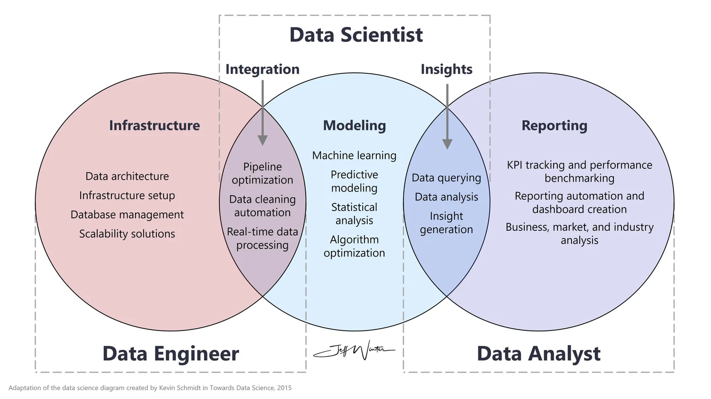

# what is data ? 

  1. data is a collection of instruction or informations i.e called data
  2. data is set of informations i.e called data 

# types of data ?

  1. structured data 
  2. unstructured data
  3. raw data 

# architectures of data in data science and data analytics

  

# 1 structured data 
  
   1. data will be in formate of row and columns 

     ```
     tables 
     excels file 
     csv data formate
     ```


# 2 unstructured data 
  
   1. data will be in formate of text, image , audio , video i.e called unstructured of  

     ```
     
      paragraph
      .png or .jpg 
      .mp3
      .mp4

     ```

# 3 raw data : 
  1. raw data is in formate of object or .json formate 

    examples: 

    ```
      object 
      or 
      json raw data 
    ```
  