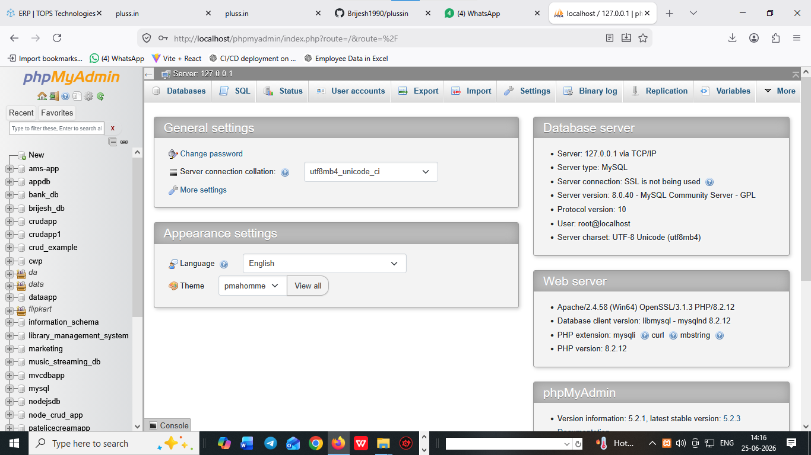

# what is RDBMS  ?

  1. RDBMS stands for relational database management systems
  2. RDBMS is used to create relational databases 
  3. database is used to create tables and stored in database 
  4. list of database name ...

     1) mysql 
     2) sqlite
     3) sql server
     4) mongoDB

# open database using xampp server

   1) xampp => xampp control
   2) xampp => apache =>mysql
   3) open any browsers
   4) localhost/phpmyadmin
   

# xampp GUI manage all relational database 

