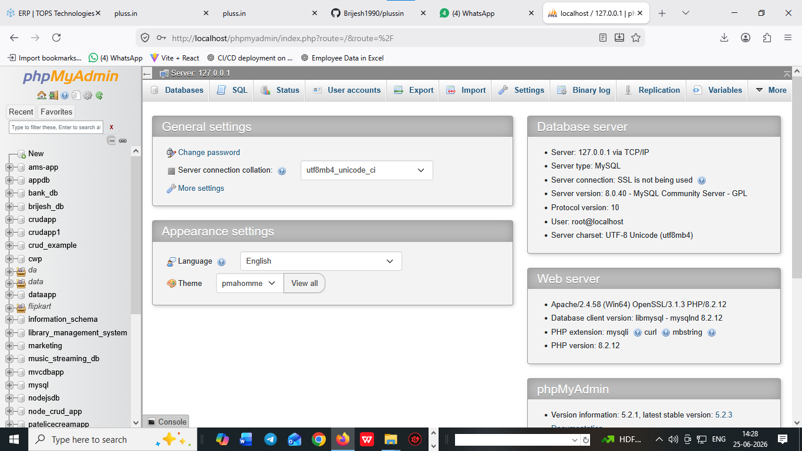

# what is SQL ?

  1. SQL stands for structure query language 
  2. SQL will used to create database and tables structures
  3. SQL will be a case insenstive language
     examples : insert | INSERT | Insert
  4. SQL create database and  table structured using SQL query or commands
  5. SQL is an structured based language 

# what is Database or MYSQL ?

  1. database is used to stored an information 
  2. MySQL is and database 
  3. MySQL database create an GUI (graphical user interface) where we create database and provides relations.
  4. MySQL provides two interface 

     1. xampp 

        
     
     2. mySQLworkbench8.0

        


# advantage of SQL ? 

  1. create database structured 
  2. create tables structured 
  3. create a structured data in form of tables 
  4. create case insenstive language 
  5. create relationship between one tables to another 
  6. create some query or commands

# SQL query or commands 

  1. DDL (data definition language) 
  2. DML (data manipulation language)
  3. DQL (data Query language) 
  4. TCL (transactional control language)


# what is  DDL  ? 

  1. DDL stands for data definition language 
  2. create database and table structured 

# DDL query list ?

  1) create database
  2) create table
  3) alter 
  4) truncate 
  5) drop 
  6) rename
  7) change 

  1) how to create database 

     **syntax**

     ```
     create database databasename;
     or
     create database data_science_app;

     ``` 


   1) how to create table 

     **syntax**

     ```
     create table tablename
     (
     columnname datatype size primary key auto_increment,
     columnname datatype(size),
     .
     .
     .
     .
     columnname datatype(size)

     )

     ```

     **examples**

     ```
     create table tbl_users
     (
     uid int AUTO_INCREMENT primary key,
     name varchar(255),
     email varchar(255),
     phone bigint,
     address text
    
     )

     ``` 

     **examples**

     ```
   create table tbl_feedback
   (
   feedbackid int AUTO_INCREMENT primary key,
   name varchar(255),
   email varchar(255),
   subject varchar(255),
   phone bigint,
   rating varchar(255),
   comment text   

   )

     ```

# create a tables with columnname 

   **categories**

     1. catid 
     2. categoryname

   **subcategories**

     1. subcatid
     2. subcategoryname

   **products**

     1. pid
     2. pname
     3. pimage
     4. qty
     5. price
     6. descriptions
     7. added_date
# SQL data types ............ 

  ## Numeric Data Types
  
| Data Type | Size | Description |
|-----------|------|-------------|
| `TINYINT` | 1 Byte | Stores very small whole numbers (-128 to 127 or 0 to 255). |
| `SMALLINT` | 2 Bytes | Stores small whole numbers. |
| `INT` / `INTEGER` | 4 Bytes | Stores standard whole numbers. |
| `BIGINT` | 8 Bytes | Stores very large whole numbers. |
| `DECIMAL(p,s)` | 5–17 Bytes* | Stores exact decimal values with specified precision and scale. |
| `FLOAT` | 4 Bytes | Stores approximate single-precision floating-point numbers. |
| `DOUBLE` | 8 Bytes | Stores approximate double-precision floating-point numbers. |


## Character/String Data Types

| Data Type | Size | Description |
|-----------|------|-------------|
| `CHAR(n)` | Fixed (`n` Bytes) | Stores fixed-length character strings. |
| `VARCHAR(n)` | Variable (up to `n` Bytes + 1–2 Bytes overhead) | Stores variable-length character strings. |
| `TEXT` | Up to 65,535 Bytes | Stores large amounts of text. |


## Date and Time Data Types

| Data Type | Size | Description |
|-----------|------|-------------|
| `DATE` | 3 Bytes | Stores a date (`YYYY-MM-DD`). |
| `TIME` | 3 Bytes | Stores a time (`HH:MM:SS`). |
| `DATETIME` | 8 Bytes | Stores both date and time. |
| `TIMESTAMP` | 4–8 Bytes | Stores date and time, often with automatic timestamp updates. |


## Boolean Data Type

| Data Type | Size | Description |
|-----------|------|-------------|
| `BOOLEAN` | 1 Byte | Stores `TRUE` or `FALSE` values. |


## Enumerated Data Types

| Data Type | Size | Description |
|-----------|------|-------------|
| `ENUM` | Fixed (`n` Bytes) | Stores fixed-length binary data with multiple choices data. |


# alter : 

  1. after create table we can add some column name in table there alter 

     ``` 
     alter table tbl_users add country varchar(255);
     or
     alter table tbl_users add state varchar(255);
     ```

  2. after any columnname add a column 

      ```
       alter table tbl_users add photo varchar(255) after email;
      ```   


  3. alter is also used to change the column name or update column name 

     ```
     alter table tbl_users change country countryname varchar(255)
     or
     alter table tbl_users change state statename varchar(255)
     
     ```
4. alter will also drop the columnname 

     ```
     
     alter table tbl_employee drop added_date_time;

     ```   

  5. alter create a unique columns 

    ```
     alter table tbl_employee add unique(`email`);
    ```   


# how to rename a table name after create any tables 

  ```
  rename table tbl_appointment to appointment;
  or
  rename table tbl_employee to employee;
  or
  rename table tbl_users to users;
  ```


# drop :  drop is used to delete database or table or any columnname of table 

  1. how to drop database

    ```
     drop database databasename
     or
     drop database data_science_app;
    ```


  
  2. how to drop table

    ```
     drop table tablename
     or
     drop table appointment;
    ```

  3. how to drop a columnname of tables 

    ```
   alter table tbl_employee drop added_date_time;

    ```  


# truncate :  truncate is used to delete all data from tables after truncate data never rollback

          ```

          truncate table tablename;
          or
          truncate table tbl_employee

        ```