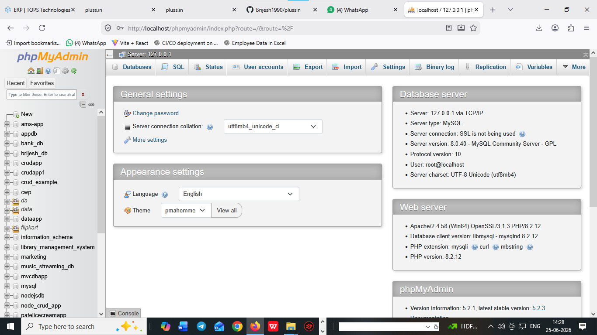
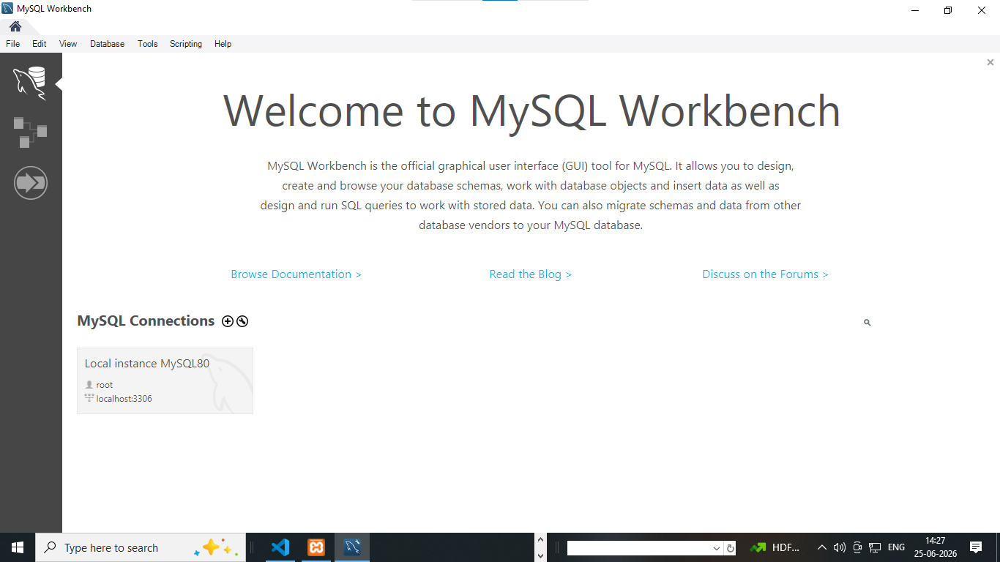

# what is SQL ?

  1. SQL stands for structure query language 
  2. SQL will used to create database and tables structures
  3. SQL will be a case insenstive language
     examples : insert | INSERT | Insert
  4. SQL create database and  table structured using SQL query or commands
  5. SQL is an structured based language 

# what is Database or MYSQL ?

  1. database is used to stored an information 
  2. MySQL is and database 
  3. MySQL database create an GUI (graphical user interface) where we create database and provides relations.
  4. MySQL provides two interface 

     1. xampp 

        
     
     2. mySQLworkbench8.0

        


# advantage of SQL ? 

  1. create database structured 
  2. create tables structured 
  3. create a structured data in form of tables 
  4. create case insenstive language 
  5. create relationship between one tables to another 
  6. create some query or commands

# SQL query or commands 

  1. DDL (data definition language) 
  2. DML (data manipulation language)
  3. DQL (data Query language) 
  4. TCL (transactional control language)


# what is  DDL  ? 

  1. DDL stands for data definition language 
  2. create database and table structured 

# DDL query list ?

  1) create database
  2) create table
  3) alter 
  4) truncate 
  5) drop 
  6) rename
  7) change 

  1) how to create database 

     **syntax**

     ```
     create database databasename;
     or
     create database data_science_app;

     ``` 


   1) how to create table 

     **syntax**

     ```
     create table tablename
     (
     columnname datatype size primary key auto_increment,
     columnname datatype(size),
     .
     .
     .
     .
     columnname datatype(size)

     )

     ```

     **examples**

     ```
     create table tbl_users
     (
     uid int AUTO_INCREMENT primary key,
     name varchar(255),
     email varchar(255),
     phone bigint,
     address text
    
     )

     ``` 

     **examples**

     ```
   create table tbl_feedback
   (
   feedbackid int AUTO_INCREMENT primary key,
   name varchar(255),
   email varchar(255),
   subject varchar(255),
   phone bigint,
   rating varchar(255),
   comment text   

   )

     ```

# create a tables with columnname 

   **categories**

     1. catid 
     2. categoryname

   **subcategories**

     1. subcatid
     2. subcategoryname

   **products**

     1. pid
     2. pname
     3. pimage
     4. qty
     5. price
     6. descriptions
     7. added_date
# SQL data types ............ 

  ## Numeric Data Types
  
| Data Type | Size | Description |
|-----------|------|-------------|
| `TINYINT` | 1 Byte | Stores very small whole numbers (-128 to 127 or 0 to 255). |
| `SMALLINT` | 2 Bytes | Stores small whole numbers. |
| `INT` / `INTEGER` | 4 Bytes | Stores standard whole numbers. |
| `BIGINT` | 8 Bytes | Stores very large whole numbers. |
| `DECIMAL(p,s)` | 5–17 Bytes* | Stores exact decimal values with specified precision and scale. |
| `FLOAT` | 4 Bytes | Stores approximate single-precision floating-point numbers. |
| `DOUBLE` | 8 Bytes | Stores approximate double-precision floating-point numbers. |


## Character/String Data Types

| Data Type | Size | Description |
|-----------|------|-------------|
| `CHAR(n)` | Fixed (`n` Bytes) | Stores fixed-length character strings. |
| `VARCHAR(n)` | Variable (up to `n` Bytes + 1–2 Bytes overhead) | Stores variable-length character strings. |
| `TEXT` | Up to 65,535 Bytes | Stores large amounts of text. |


## Date and Time Data Types

| Data Type | Size | Description |
|-----------|------|-------------|
| `DATE` | 3 Bytes | Stores a date (`YYYY-MM-DD`). |
| `TIME` | 3 Bytes | Stores a time (`HH:MM:SS`). |
| `DATETIME` | 8 Bytes | Stores both date and time. |
| `TIMESTAMP` | 4–8 Bytes | Stores date and time, often with automatic timestamp updates. |


## Boolean Data Type

| Data Type | Size | Description |
|-----------|------|-------------|
| `BOOLEAN` | 1 Byte | Stores `TRUE` or `FALSE` values. |


## Enumerated Data Types

| Data Type | Size | Description |
|-----------|------|-------------|
| `ENUM` | Fixed (`n` Bytes) | Stores fixed-length binary data with multiple choices data. |


# alter : 

  1. after create table we can add some column name in table there alter 

     ``` 
     alter table tbl_users add country varchar(255);
     or
     alter table tbl_users add state varchar(255);
     ```

  2. after any columnname add a column 

      ```
       alter table tbl_users add photo varchar(255) after email;
      ```   


  3. alter is also used to change the column name or update column name 

     ```
     alter table tbl_users change country countryname varchar(255)
     or
     alter table tbl_users change state statename varchar(255)
     
     ```
4. alter will also drop the columnname 

     ```
     
     alter table tbl_employee drop added_date_time;

     ```   

  5. alter create a unique columns 

    ```
     alter table tbl_employee add unique(`email`);
    ```   


# how to rename a table name after create any tables 

  ```
  rename table tbl_appointment to appointment;
  or
  rename table tbl_employee to employee;
  or
  rename table tbl_users to users;
  ```


# drop :  drop is used to delete database or table or any columnname of table 

  1. how to drop database

    ```
     drop database databasename
     or
     drop database data_science_app;
    ```


  
  2. how to drop table

    ```
     drop table tablename
     or
     drop table appointment;
    ```

  3. how to drop a columnname of tables 

    ```
   alter table tbl_employee drop added_date_time;

    ```  


# truncate :  truncate is used to delete all data from tables after truncate data never rollback

          ```

          truncate table tablename;
          or
          truncate table tbl_employee

        ```
# what is DML (data manipulate language) ?

1. DML stands for data manipulation language 
2. it is used to manipulate data after creating tables 
3. DML handel insert | delete and update data 

## DML query are 

1. insert
- insert a single or multiple rows in tables 
- how to add or insert single data 
- examples 
```
insert into tablename(columnname) values('value');
or 
insert into tbl_categories(categoryname) value('electronics')
or
insert into tbl_employee(name,upload_photo,age,phone,salary,attendance,status,email) value('meet','meet.jpg',21,912221545,15500,1,'pending','meet@gmail.com');
```   

- how to add multiple data
- examples ......

```
insert into tbl_employee(name,upload_photo,age,phone,salary,attendance,status,email) values('brijesh','brijesh.jpg',31,912821545,155000,1,'pending','brijesh@gmail.com'),('pranav','pranav.jpg',31,982221545,17500,1,'pending','pranav@gmail.com');

or


insert into tbl_employee values(null,'forum','forum.jpg',21,652821545,14000,1,'pending','forum@gmail.com'),(null,'astha','astha.jpg',21,982221545,17500,1,'pending','astha@gmail.com');

```
2. delete 
 - delete is used to delete data 
 - delete are used to delete all data from tables 
 - delete are used to delete particular data using where clause
 - delete are used to delete range of  data from tables
 - delete are used to delete alternate of data from tables     

## query are ....

 ```
 delete from tbl_employee   (delete all rows from tables)
 delete from tbl_employee where empid=1 (delete particular 1 data from table)
 delete from tbl_employee where empid in (1,3,5,7);  (alternate delete)
 delete from tbl_employee where empid between 500 and 1000; (range of data delete)

 ``` 
# note : after delete rows of data from tables we cam rollback data 

  
3. update :

   - update is used to update rows or data from tables 
   - update is used to update particulars data from tables using where clause
   - examples are ....

   ```
   update tbl_employee set name='kumar',upload_photo='kumar.png',age=33,phone=634545845,salary=18500,attendance=0,status='completed',email='kumar007@gmail.com' where empid=4;
   ```


# what is DQL (data query language) ?

  - DQL stands for data query language 
  - DQL is used to select data or fetch data  
  - DQL query are ...

    1. select  (select all data)
       
       ```
       select * from tbl_employee
       ```

    2. select  (select particular 1 data)
       
       ```
       select * from tbl_employee where empid=4
       ```

   
    3. select  (select particular range of data)
       
       ```
       select * from tbl_employee where empid between 1 and 5;
       ```    
    
    4. select  (select particular alternate of data)
       
       ```
       select * from tbl_employee where empid in (1, 2, 4, 7);
       ```    

    5. select  (select particular columnname of data)
       
       ```
       select empid,name,salary from tbl_employee;
       ```    

    
    6. select  (select particular with name of data)
       
       ```
       select * from tbl_employee where name='kumar';
       ```    
    
    7. select  (select name is ascending order or descending order)
       
       # order by  : filter in asc and desc order
       ```
       select * from tbl_employee  order by name asc;
       or
       select * from tbl_employee  order by name;
       or
       select * from tbl_employee  order by name desc;
       ```    

# TCL : stands for transanctional control language

  - TCL is used to rollback data from table
  - TCL is also used to commit data from table 
  - TCL query are .....

    1. commit
    2. rollback  

## commit ....

   - commit is used to start transaction and commit(save) data before delete
   - commit is always used before delete data from tables 
  - how to commit data before delete 
  
   # commit .....

   ```
    START TRANSACTION;
    delete from tbl_employee where empid=7;
    COMMIT; 
   ```  


# rollback : 

  - rollback start transaction and rollback data 
  - rollback are used to rollback data in tables after delete 
  - rollback query are ...

  ## rollback ...

    ```
    START TRANSACTION;
    delete from tbl_employee
    WHERE empid=7;
    SELECT * FROM tbl_employee WHERE empid=7;
    ROLLBACK;
    SELECT * FROM tbl_employee WHERE empid = 7;

    ``` 

# Note : some database structures not support rollback and commit   

# key constraints :  

  - key constraints provides limit on tables 
  - key constraints used to provides normalized tables 
  - key constraints are used to provides relationship between tables 

  ## types of key constraints

  1. primary key 
  2. unique key 
  3. foreign key  

   
    

# key constraints :  

  - key constraints provides limit on tables 
  - key constraints used to provides normalized tables 
  - key constraints are used to provides relationship between tables 

## types of key constraints

  1. primary key 
  2. unique key 
  3. foreign key  


# primary key   :

  - A pk is never stored null values 
  - A pk never repeated only provides one times in a table
  - A pk is always auto_increments 
  - A pk stored unique values 
  
   **examples**

| uid(pk) | Name   | Salary | age |
|---------|--------|--------|-----|
| 1       |Brijesh | 85000  | 35  |


# unique key   :

  - A uk is never at list one time stored a null  values 
  - A uk repeated more than one columns
  - A uk is never stored a dublicate values 
 
  
   **examples**

| uid(pk) | Name   | Salary | age | email(uk)   | phone(uk) |
|---------|--------|--------|-----|-------------|-----------|
| 1       |Brijesh | 85000  | 35  | b@gmail.com |9173357217 |


   **syntax of SQL to create unique key**

   ```
   alter table user add unique(`email`);
   or
   alter table user add unique(`phone`);

   ```

# foreign key   :

  - A fk is never stored null values 
  - A fk repeated more than one columns
  - A fk is  can be  stored a dublicate values
  - A fk is provides relationship between one table to another table  
  - A fk provides relationship b/w one tables to another table using common field
 
  
**examples**

**country**

| cid(pk) | cname     |
|---------|-----------|
| 1       |India      |
| 2       |USA        |
| 3       |UK         |
| 4       |Australia  |


**users**

| uid(pk) | Name   | Salary | age | email(uk)   | phone(uk) |cid(fk)|
|---------|--------|--------|-----|-------------|-----------|-------|
| 1       |Brijesh | 85000  | 35  | b@gmail.com |9173357217 | 1     |
| 2       |Meet    | 75000  | 35  | m@gmail.com |9173357817 | 3     |
| 3       |Kumar   | 35000  | 35  | k@gmail.com |9173357917 | 4     |
| 4       |lokesh  | 45000  | 35  | l@gmail.com |9173357117 | 2     |


**syntax of SQL to create table with foreign key**

   ```
   create table music_streaming_app.country
   (
   cid int  auto_increment primary key,
   cname varchar(255)  
   )

   ```

   ```
   create table music_streaming_app.users
  (
  uid int  auto_increment primary key,
  uname varchar(255),
  gender varchar(255),
  phone bigint,
  pincode int, 
  address text,
  cid int references country(cid)  
  )

   ```


# SQL join .....
  
   1. SQL join are used to join more than one table with common field 
   2. SQL join are used to join with common field with match data from one table to another table via common field 

## types of join 

   1. join 
   2. inner join 
   3. outer join 

      - left join 
      - right join 
      - full join 
   4. cross join 


# join :

  1. join is used to join more than one table with common filed 
  2. join is used to join with one table to another with matched data from one table to another 


  **syntax**

  ```
  select 1st table.*, columnname from 1st table join 2nd table on 1st table.common field=2nd table.common field 
  or
  select users.*,cname from users join country on users.cid=country.cid; 
  or
  select uid,uname,phone,address,cname from users join country on users.cid=country.cid;
  ``` 


# inner join :

  1. inner join is used to join more than one table with common filed 
  2. inner join is used to join with one table to another with matched data from one table to another 


  **syntax**

  ```
  select 1st table.*, columnname from 1st table inner join 2nd table on 1st table.common field=2nd table.common field 
  or
  select users.*,cname from users inner join country on users.cid=country.cid; 
  or
  select uid,uname,phone,address,cname from users inner join country on users.cid=country.cid;
  ``` 


# outer join ...

  1. outer join is used to join with common field if data matched one table to another table its join other return null values

    - left join 
    - right join 
    - full join (not support in mysql)  


## left join ... 

   1. left join is used to join 1st table of left rows with second table of left rows if data matched if not matched return null values 

   **left join**

     ```
  select 1st table.*, columnname from 1st table left join 2nd table on 1st table.common field=2nd table.common field 
  or
  select users.*,cname from users left join country on users.cid=country.cid; 
  or
  select uid,uname,phone,address,cname from users left join country on users.cid=country.cid;
  ``` 


## right join ... 

   1. right join is used to join 2nd table of right rows with 1st table of right rows if data matched  join all data if not matched return null values 

   **right join**

     ```
  select 1st table.*, columnname from 1st table right join 2nd table on 1st table.common field=2nd table.common field 
  or
  select users.*,cname from users right join country on users.cid=country.cid; 
  or
  select uid,uname,phone,address,cname from users right join country on users.cid=country.cid;
  ``` 


# cross join ... 

  1. cross join is used to join data from first table to second table with cross or multiplication of total rows either data matched or not 

  2. cross join is used to return dublicate of data again and again 

  **syntax**

  ```
  select * from users cross join country;
  
  ```
    
# SQL functions .....

  1. SQL function is provides  an inbuilt function 
  2. SQL function is performed some action 
  2. SQL function  are two types ....
  
     - aggrigate function 
       1. avg()
       2. max()
       3. min()
       4. count()
       5. sum()
     - scalar function

       1. first()
       2. last()
       3. ucase()
       4. lcase()  

## examples of SQL function 

1. select avg(salary) as average_salary from employee;
2. select max(salary) as max_salary from employee;
3. select min(salary) as min_salary from employee; 
4. select count(empid) as total_count_employee from employee;
5. select sum(salary) as sum_salary from employee;    
6. select first(empname) as first_columndata from employee;
7. select last(empname) as last_columndata from employee;
8. select ucase(empname) as uppercase_name from employee;   
9. select lcase(empname) as lowercase_name from employee; 

# SQL subquery ... 

  1. SQL subquery is used query within another query there we used subquery
  2. find second highest salary from table employee
  
    **subquery**

    ```
    select max(salary) from employee WHERE salary < (select max(salary) from employee)

    ```

## how to find second highest salary with order by 

   **examples**

   ```
   Highest salary find 

   select * from employee order by salary desc limit 0,1;

   second highest salary 

   select * from employee order by salary desc limit 1,1;

   Third highest salary 

   select * from employee order by salary desc limit 2,1;

   ```

# index and indexer ?

1.Index and indexer are used to increase speed of table


2.index are used to creat optimized speed of tables

# SQL indexer or index ? 

1. index or indexer create to improved SQL speed of tables 
2. index are used to create optimized speed of tables 
3. indexer also create to fast search or lookup data from tables 
4. indexer are used to create one column or multiple columns of table 

**types of indexer or index**

1) single indexer(create index on one column)
**examples**
``` 
create index indexname on tablename columnname1; 
or
create index index_tbl_employee on tbl_employee(empid);
```
2) composite indexer(create index on one or multiple column)
**examples**
``` 
create index indexname on tablename (columnname1,columnname2,columnname3,columnname4......);
or

create index index_tbl_employee on tbl_employee (empid,name,email,mobile,salary) 
```


# what is view in SQL ? 

1. view is used to create an dublicate table of main table 
2. view is used to create a virtual tables of main table 
3. view is used to hide some data from some users there we used view 

# syntax :  

```
create view viewname as select columnname1, columnname2...from tablename where empid=1;
or
create view viewname as select columnname1, columnname2...from tablename
or
create view viewname as select * from tablename;

``` 
# note : view is used to create a dublicate table or virtuals table of main tables 

# Note:   

**examples**

```
create view viewname as select columnname1, columnname2...from tablename where empid=1;

or

update  tbl_view_users set name='jinal',age=35,mobile=653545454,address='150 feet ring road rajkot',cid=3 where uid=3 

or

delete from tbl_view_users  where uid=3 

```

# SQL windows functions .....

1. SQL windows functions is used to applied calculation | add unique rows to current rows in a tables 

2. SQL windows functions are used to add or set a rows related to the current row without grouping the result into a single row 


# types of  windows functions 

1. ROW_NUMBER()

2. RANK()

3. DENSE_RANK()

4. NTILE()

5. LAG()

6. LEAD()

7. FIRST_VALUE()

8. LAST_VALUE()

9. SUM() OVER()

10. AVG() OVER()

11. MIN() OVER()

12) MAX() OVER()

13) COUNT() OVER()


# create a tables employee ....  

1. create table name with flip_employee

2. ROW_NUMBER(): assingns a unique number to each rows 

```
select name , salary , ROW_NUMBER() OVER(order by salary desc) from tbl_employee  

```

3. RANK() : provides ranking with gaps for dublicate values 

```
select name, salary, RANK() OVER(order by salary desc) as rank_no from tbl_employee;  
```

4. DENSE_RANK() : provides ranking without gaps for dublicate values 

```
select name, salary, DENSE_RANK() OVER(order by salary desc) as rank_no from tbl_employee;

```

5. NTILE() : divides rows into equal group 

``` 
select name, salary, NTILE(3) OVER(order by salary desc) as group_no from flip_employee;
```

6. LAG() : return previous rows values 

```
select name, salary , LAG(salary, 1) OVER(order by salary desc) as prevoius_salary from tbl_employee; 
``` 

7. LEAD() : return next row value 

```
select name, salary , LEAD(salary, 1) OVER(order by salary desc) as prevoius_salary from flip_employee;   

```

8. FIRST_VALUES() : return first values in windows 

```
select name, salary , FIRST_VALUE(salary) OVER(order by salary desc) as first_max_salary from flip_employee; 
``` 


8. LAST_VALUES() : return last values in windows 

```
select name, salary , LAST_VALUE(salary) OVER(order by salary desc) as LAST_VALUES_SALARY from flip_employee; 

``` 

9. SUM() : running with total in windows 

```
select name, salary , SUM(salary) OVER(order by salary) as total_sum_SALARY from flip_employee; 

```


9. AVG() : running with avg in windows 

```
select name, salary , AVG(salary) OVER(order by salary) as average_salary from tbl_employee; 

```

10. MIN() OVER(): minimum values in windows

```
select name, salary , MIN(salary) OVER(order by salary) as MIN_SALARY from tbl_employee;      

```


10. MAX() OVER(): maximum values in windows

```
select name, salary , MAX(salary) OVER(order by salary) as MAX_SALARY from tbl_employee;      

```

11) COUNT() OVER() : count rows of windows

```
select name, salary , COUNT(empid) OVER(order by empid) as COUNT_EMPLOYEE from tbl_employee;    
```    

# SQL WITH Clause

1. The SQL WITH clause (Common Table Expression or CTE) defines a temporary result set that can be used within a query. 
2. It simplifies complex SQL statements, making them easier to read, manage and reuse. 

```
WITH AvgSalaryCTE (averageValue) AS (
SELECT AVG(Salary)
FROM tbl_employee
)
SELECT 
empid,
name, 
salary 
FROM 
tbl_employee 
WHERE 
Salary > (SELECT averageValue FROM AvgSalaryCTE);

```      